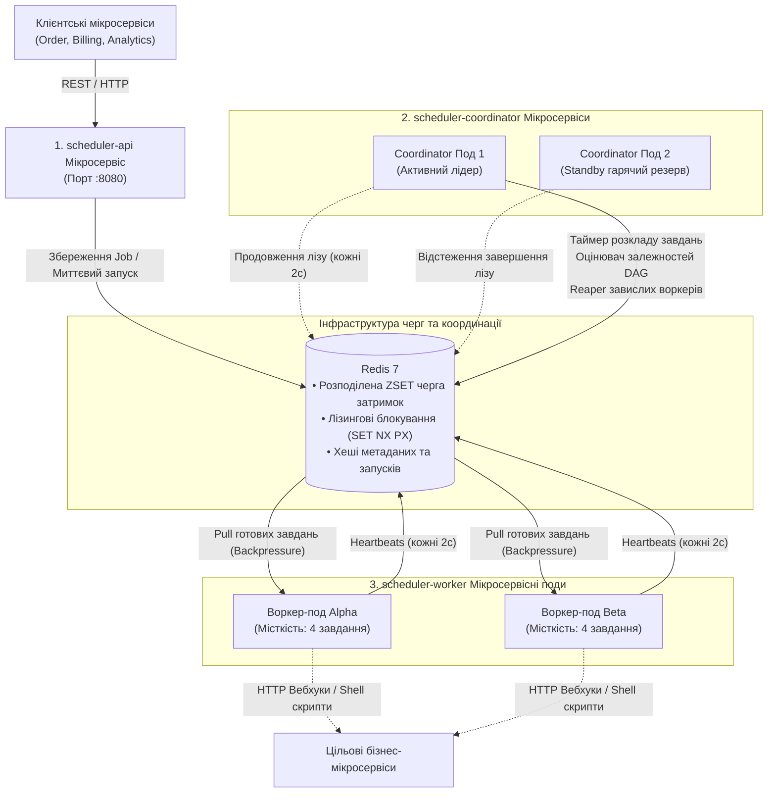
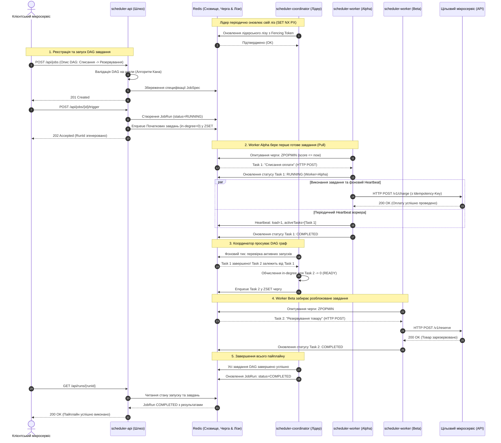
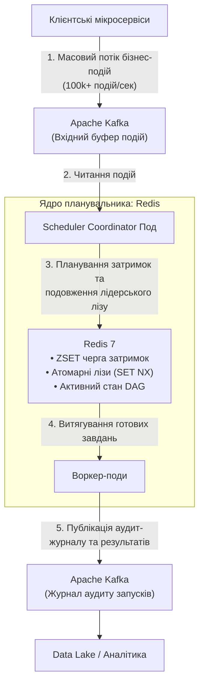

# Розподілений планувальник завдань та оркестратор робочих процесів (Мікросервісна архітектура)

[](https://kotlinlang.org)
[](https://openjdk.org)
[](https://ktor.io)
[]()
[]()

Розподілений планувальник завдань та оркестратор DAG-робочих процесів, декомпонований на **незалежні контейнеризовані мікросервіси** та спроєктований за канонічним питанням із **System Design співбесід** (*«Design a Distributed Job Scheduler / Workflow Orchestrator like Temporal, Airflow, or Quartz»*), які проводять у Google, Meta, Uber, Amazon та Netflix.

---

## Зміст
1. [Мікросервісна декомпозиція](#1-мікросервісна-декомпозиція)
   - [Архітектурна топологія](#архітектурна-топологія)
   - [Діаграма послідовності (Sequence Diagram)](#діаграма-послідовності-sequence-diagram)
   - [Ролі та обов'язки мікросервісів](#ролі-та-обов-язки-мікросервісів)
2. [Системний дизайн: Шаблон для співбесід](#2-системний-дизайн-шаблон-для-співбесід)
   - [Функціональні та нефункціональні вимоги](#функціональні-та-нефункціональні-вимоги)
   - [Оцінка пропускної здатності та масштаб](#оцінка-пропускної-здатності-та-масштаб)
3. [Поглиблені теми для системного дизайну](#3-поглиблені-теми-для-системного-дизайну)
   - [Доставка «щонайменше один раз» (At-Least-Once) та міжсервісна ідемпотентність](#доставка-щонайменше-один-раз-at-least-once-та-міжсервісна-ідемпотентність)
   - [Захист від Split-Brain через монотонні токени розмежування (Fencing Tokens)](#захист-від-split-brain-через-монотонні-токени-розмежування-fencing-tokens)
   - [Високоточне відкладене планування (Дворівнева бакетизація часу)](#високоточне-відкладене-планування-дворівнева-бакетизація-часу)
   - [Модель диспетчеризації: Push проти Pull та Backpressure](#модель-диспетчеризації-push-проти-pull-та-backpressure)
   - [Оркестрація DAG через алгоритм Кана (Kahn's Algorithm)](#оркестрація-dag-через-алгоритм-кана-kahns-algorithm)
   - [Моніторинг воркерів, Heartbeats та рекламація завдань](#моніторинг-воркерів-heartbeats-та-рекламація-завдань)
   - [Експоненційне відтермінування з джитером (Exponential Backoff with Jitter) та черга DLQ](#експоненційне-відтермінування-з-джитером-exponential-backoff-with-jitter-та-черга-dlq)
   - [Детальне архітектурне обґрунтування: Чому обрано Redis замість Kafka](#детальне-архітектурне-обґрунтування-чому-обрано-redis-замість-kafka)
4. [Багатомодульна структура кодової бази](#4-багатомодульна-структура-кодової-бази)
5. [Запуск мікросервісів](#5-запуск-мікросервісів)
   - [Варіант A: Docker Compose (Повний розподілений кластер)](#варіант-a-docker-compose-повний-розподілений-кластер)
   - [Варіант B: Локальні Gradle-сервіси (Режим розробки)](#варіант-b-локальні-gradle-сервіси-режим-розробки)
   - [Інтерактивна веб-панель керування (Dashboard)](#інтерактивна-веб-панель-керування-dashboard)
   - [Приклади REST API для клієнтських мікросервісів](#приклади-rest-api-для-клієнтських-мікросервісів)
6. [Верифікація тестового набору](#6-верифікація-тестового-набору)

---

## 1. Мікросервісна декомпозиція

Замість монолітної структури система розділена на спеціалізовані, незалежно розгортані мікросервісні субпроєкти:

### Архітектурна топологія



---

### Діаграма послідовності (Sequence Diagram)

Діаграма демонструє наскрізний життєвий цикл: від реєстрації DAG-пайплайну клієнтським мікросервісом до лідерської координації, паралельного виконання воркерами через HTTP-вебхуки та автоматичного просування графа залежностей.



---

### Ролі та обов'язки мікросервісів

| Мікросервіс | Модуль коду | Стратегія масштабування | Основна відповідальність |
| :--- | :--- | :--- | :--- |
| **`scheduler-api`** | `scheduler-api` | Без збереження стану (Stateless, $N$ реплік за Ingress) | Вхідний REST API для зовнішніх систем, реєстрація завдань, запит статусу, керування DLQ, вбудований Web Dashboard. |
| **`scheduler-coordinator`** | `scheduler-coordinator` | Активний-Резервний (Active-Standby, $2$–$3$ репліки) | Годинник розкладу, подовження лідерського лізу, просування залежностей DAG, виявлення та рекламація завислих воркерів. |
| **`scheduler-worker`** | `scheduler-worker` | Горизонтальне авто-масштабування ($N$ воркер-подів) | Витягування завдань із черги, контроль ліміту місткості, виконання HTTP-вебхуків/скриптів, надсилання heartbeats. |
| **`scheduler-storage`** | `scheduler-storage` | Спільна бібліотека | Високопродуктивний шар роботи з Redis та SQLite, розподілені лізи та черга затримок на базі пріоритетів. |
| **`scheduler-common`** | `scheduler-common` | Спільна бібліотека | Доменні моделі даних, рушій DAG на базі алгоритму Кана та парсер 5-значних Cron-виразів. |

---

## 2. Системний дизайн: Шаблон для співбесід

### Функціональні та нефункціональні вимоги

#### Функціональні вимоги (Core Functional Requirements)
1. **Гнучке планування за часом**:
   - **Миттєвий запуск (Immediate)**: Запуск завдання одразу після отримання запиту.
   - **Одноразові відкладені завдання (Future Date / One-off)**: Виконання у визначений момент у майбутньому (наприклад, через 2 години або 15 вересня о 14:00).
   - **Періодичні розклади (Recurring Schedule / Cron)**: Регулярний запуск за розкладом (наприклад, *"щодня о 10:00 AM"*, *"кожні 5 хвилин"*).
2. **Залежності робочих процесів (DAG Workflows)**:
   - Підтримка складних ланцюжків завдань, де наступні кроки запускаються лише після успіху попередніх (перевірка циклів за **алгоритмом Кана**).
3. **Моніторинг статусу (Status Monitoring)**:
   - Можливість перевіряти статус завдань та запусків у реальному часі (`QUEUED`, `RUNNING`, `COMPLETED`, `FAILED`, `DEAD_LETTER`).

#### Нефункціональні вимоги (Core Non-Functional Requirements)
1. **Масштабованість до 10,000 завдань/сек (Scalability up to 10k QPS)**:
   - Система повинна стабільно обробляти та виконувати **$10{,}000$ завдань щосекунди** (з піками до $20{,}000 - 30{,}000$ QPS).
2. **Висока доступність (High Availability: Availability > Consistency)**:
   - За теоремою CAP система обирає **AP (Availability + Partition Tolerance)**.
   - Відмова окремих вузлів, мережеві затримки або реплікаційні лаги не повинні блокувати прийом завдань API чи виконання решти черги.
3. **Жорсткий SLA виконання (Execution SLA $\le 2\text{s}$)**:
   - Завдання повинні запускатися **не пізніше ніж через 2 секунди** від їхнього запланованого часу.
4. **Гарантія виконання «щонайменше один раз» (At-Least-Once Execution)**:
   - Жодне завдання не може бути втрачене. У разі аварії воркера завдання автоматично рекламується і перезапускається. Клієнти використовують `Idempotency-Key` для запобігання дублюванню бізнес-ефектів.

---

### Оцінка пропускної здатності та масштаб (Capacity Estimation: 10k QPS)

* **Частота виконання (Execution Throughput)**:
  $$10{,}000\text{ завдань/сек} \ (\text{пік: } 20{,}000 - 30{,}000\text{ QPS})$$
* **Добовий обсяг (Daily Volume)**:
  $$10{,}000 \times 86{,}400 \approx \mathbf{864\text{ мільйони завдань/добу}} \ (\sim 1\text{ млрд/день})$$
* **Вхідна/вихідна мережа (Network I/O)**:
  При середньому розмірі payload $1\text{ КБ}$:
  $$10{,}000 \times 1\text{ КБ} = \mathbf{10\text{ МБ/сек}} \ (80\text{ Мбіт/сек})$$
* **Зберігання історії за 30 днів (Storage for 30 Days)**:
  $$864\text{ млн} \times 1\text{ КБ} = 864\text{ ГБ/добу} \implies 864\text{ ГБ} \times 30 \approx \mathbf{26\text{ ТБ}}$$
  *(Зберігається в розподіленій базі даних ScyllaDB/Cassandra з вивантаженням холодних даних у Data Lake/S3).*
* **Гарячий буфер черги в пам'яті (RAM for 10-Minute Window in Redis)**:
  Якщо буферизувати в Redis завдання на найближчі 10 хвилин:
  $$10{,}000\text{ jobs/sec} \times 600\text{ sec} \times 1\text{ КБ} \approx \mathbf{6\text{ ГБ RAM}}$$
* **Шардування для забезпечення SLA $\le 2\text{s}$**:
  Розподіл на **64 віртуальні шарди** (`hash(job_id) % 64`):
  $$\frac{10{,}000\text{ QPS}}{64} \approx \mathbf{156\text{ операцій/сек на шард}}$$
  Кожен шард Redis виконує операцію вибірки `ZPOPMIN` за $<1\text{ мс}$, а час затримки запуску становить лише **$150 - 300\text{ мс}$**, що з великим запасом вкладається в ліміт **$\le 2\text{ секунди}$**.

---

## 3. Поглиблені теми для системного дизайну

### Доставка «щонайменше один раз» (At-Least-Once) та міжсервісна ідемпотентність
- **Чому гарантія Exactly-Once неможлива**: Проблема двох генералів та мережеві збої унеможливлюють абсолютну гарантію доставки без ризику втрати повідомлення.
- **Архітектурне рішення**: **At-Least-Once доставка + Ідемпотентні приймачі**:
  1. Кожен екземпляр завдання має детермінований унікальний ID: `taskInstanceId = "${runId}-${taskId}-${attempt}"`.
  2. База даних використовує **атомарні оновлення за умовою** (`ON CONFLICT(instance_id) DO UPDATE`).
  3. Під час виклику зовнішніх мікросервісів через HTTP воркери передають заголовок `Idempotency-Key: ${taskInstanceId}`.

### Захист від Split-Brain через монотонні токени розмежування (Fencing Tokens)
- **Проблема**: Якщо активний Master зависає через тривалу GC-паузу або мережеву затримку, резервний вузол оголошує себе лідером. Коли старий Master відновлює роботу, виникає ситуація **розщеплення мозку (Split-Brain)**, коли два вузли одночасно керують чергою.
- **Рішення (Martin Kleppmann Fencing Tokens)**:
  1. Кожне нове обрання лідера супроводжується атомарним інкрементом монотонного лічильника: $E_{k+1} = E_k + 1$.
  2. Кожне завдання чи операція збереження стану маркується цим токеном.
  3. Воркери та шар збереження даних відкидають будь-які операції від лідерів із застарілим токеном.

### Високоточне відкладене планування (Дворівнева бакетизація часу)
- **Поширена помилка на співбесіді**: Виконання SQL-запиту `SELECT * FROM jobs WHERE scheduled_at <= NOW()` щосекунди створює колосальне навантаження на БД при мільйонах записів.
- **Дворівневий підхід (Two-Tier Scheduling)**:
  1. **Рівень 1 (Дискова БД / Холодне сховище)**: Зберігає всі завдання на дні та місяці вперед. Фонові префетчери щохвилини вибирають батч на наступні 60 секунд.
  2. **Рівень 2 (In-Memory / Гаряча черга)**: Завдання на поточну хвилину потрапляють у **Min-Heap (пріоритетну чергу)** або **Redis Sorted Set (`ZSET`)**, де ключем є timestamp. Потік диспетчера спить рівно до часу настання найближчого завдання.

### Модель диспетчеризації: Push проти Pull та Backpressure
- **Недоліки Push-моделі**: Майстер надсилає завдання безпосередньо воркеру. Якщо Воркер A зайнятий важким обчисленням, він перевантажується, тоді як Воркер B простоює.
- **Переваги Pull-моделі (реалізовано тут)**: Воркери витягують нові завдання з черги тільки за наявності вільних ресурсів (`currentLoad < capacity`). Це забезпечує **природне балансування навантаження** та захист від перевантаження (**Backpressure**).

### Оркестрація DAG через алгоритм Кана (Kahn's Algorithm)
- **Валідація графа**: Під час реєстрації завдання перевіряються за допомогою алгоритму Кана:
  $$\text{inDegree}(v) = \text{кількість незавершених вхідних залежностей}$$
  Якщо довжина топологічно відсортованого списку менша за загальну кількість завдань, граф містить цикл і відхиляється на етапі валідації.
- **Динамічний рух графа**: Коли Task $U$ переходить у статус `COMPLETED`, координатор перевіряє всі залежні завдання $V$. Якщо для всіх батьківських кроків $P$ статус дорівнює `COMPLETED`, Task $V$ автоматично стає в чергу на виконання.

### Моніторинг воркерів, Heartbeats та рекламація завдань
- Кожні 2 секунди воркери надсилають heartbeat: `WorkerInfo(workerId, capacity, currentLoad, activeTasks)`.
- Якщо $T_{\text{now}} - T_{\text{lastHeartbeat}} > 8\text{ секунд}$, фоновий процес **Reaper** оголошує воркер мертвим (`DEAD`).
- Усі незавершені завдання цього воркера негайно рекламуються та перевиставляються в чергу з оновленням лічильника спроб.

### Експоненційне відтермінування з джитером (Exponential Backoff with Jitter) та черга DLQ
- Пауза між повторними спробами розраховується з додаванням псевдовипадкового джитеру:
  $$\text{delay} = \min(\text{maxBackoff}, \text{base} \times 2^{\text{attempt}-1}) + \text{random}(0, \text{jitter})$$
- Джитер запобігає проблемі **«громового стада» (Thundering Herd)**, коли тисячі воркерів одночасно штурмують зовнішній сервіс після збою.
- Якщо `attempt > maxRetries`, завдання скеровується в **Dead Letter Queue (DLQ)** для ручного аудиту та повторного запуску.

---

### Детальне архітектурне обґрунтування: Чому обрано Redis замість Kafka

Типове запитання на System Design інтерв'ю:  
> **«Чому для черги планувальника та координації обрано Redis, а не Apache Kafka?»**

Хоча Kafka є неперевершеним інструментом для потокового оброблення подій (Event Streaming), її використання як **черги планувальника завдань** призводить до фундаментальних архітектурних протиріч:

#### Порівняльна матриця можливостей

| Характеристика | Redis (`ZSET` / Streams) | Apache Kafka | Переможець для планувальника |
| :--- | :--- | :--- | :---: |
| **Планування на довільний час у майбутньому** | **Нативно ($O(\log N)$)** через `ZSET`, де `score = scheduled_epoch_ms`. Воркери забирають завдання, де `score <= now`. | **Не підтримується нативно**. Kafka є строго послідовним логом запису (append-only) і не може сортувати повідомлення за часом. | 🏆 **Redis** |
| **Вибірковий ACK та ізольовані повтори (Retries)** | **Підтримується**. Воркери забирають окремі завдання. Помилка одного кроку не блокує інші паралельні завдання. | **Проблема Head-of-Line Blocking**. Зміщення (Offset) комітяться послідовно. Неможливо відкласти повідомлення 42, підтвердивши 43. | 🏆 **Redis** |
| **Пріоритетні черги** | **Нативно**. Завдання сортуються за вагою або розподіляються за рівнями пріоритету (`BLPOP high med low`). | **Немає пріоритету всередині партиції**. Усі повідомлення строго FIFO. Потрібні окремі топіки під кожен рівень. | 🏆 **Redis** |
| **Розподілені блокування та вибори лідера** | **Нативно та атомарно** за допомогою команди `SET lock_key token NX PX duration`. | **Не підтримується**. Kafka не надає клієнтам API для координації та лізингових блокувань. | 🏆 **Redis** |
| **Динамічне масштабування воркерів** | **Динамічно**. Будь-яка кількість воркерів ($N$) може паралельно витягувати завдання з однієї черги. | **Обмежено партиціями**. Кількість активних консьюмерів у групі не може перевищувати кількість партицій ($N \le \text{partitions}$). | 🏆 **Redis** |
| **Пропускна здатність** | Висока ($50\text{k} - 100\text{k}$ оп/сек на вузол), лімітована оперативною пам'яттю (RAM). | **Колосальна ($1\text{M}+$ подій/сек)** завдяки послідовному запису на диск та OS Page Cache. | 🏆 **Kafka** |
| **Зберігання історії та повторне програвання** | In-Memory з періодичними знімками (AOF/RDB). Оптимально для активних/транзитних завдань. | **Незмінний журнал фіксацій**. Зберігає терабайти історії тижнями; дозволяє повний replay з нульового зміщення. | 🏆 **Kafka** |
| **Складність супроводу** | **Мінімальна**. Один легковажний бінарник або керований хмарний інстанс. | **Висока**. Потребує кворуму KRaft/ZooKeeper, балансування партицій, тюнінгу консьюмер-груп. | 🏆 **Redis** |

#### Чому Kafka не підходить на роль ядра планувальника:
1. **Відсутність затримок (Блокування партиції через FIFO)**:
   Якщо Завдання B заплановане на 14:00, а Завдання A на 10:05, у лозі Kafka вони запишуться по черзі:
   ```
   [Offset 0: Завдання B (Час: 14:00)] ----> [Offset 1: Завдання A (Час: 10:05)]
   ```
   Оскільки консьюмер читає партицію послідовно, дійшовши до Offset 0, він змушений **заблокувати читання всієї партиції на 4 години**, блокуючи виконання Завдання A.
2. **Head-of-Line Blocking під час повторних спроб**:
   Зміщення в Kafka монотонні. Якщо Завдання 2 зазнало збою та потребує повтору через 30 секунд, не можна підтвердити Завдання 3 без ризику втрати Завдання 2 при падінні воркера. Створення кілець топіків повторів (`retry-1m`, `retry-5m`) створює надмірне операційне навантаження.
3. **Обмеження кількості воркерів партиціями**:
   Якщо топік розбито на 8 партицій, то навіть під час масштабування пулу воркерів у Kubernetes до 16 подів — **8 подів простоюватимуть без роботи**. У Redis же сотні подів можуть одночасно розбирати одну спільну чергу.

#### Продакшн-патерн: Гібридна архітектура
У високонавантажених системах (Uber Cadence, Temporal, Netflix Conductor) обидва інструменти працюють у синергії:



- **Kafka на вході**: Поглинає величезні сплески вхідних подій з високою швидкістю.
- **Redis у центрі**: Забезпечує роботу рушія завдань — перевірку умов DAG, похвилинну/посекундну точність через `ZSET` та арбітраж лідера.
- **Kafka на виході**: Зберігає повний незмінний аудит усіх запусків для аналітики та довгострокового збереження.

---

## 4. Багатомодульна структура кодової бази

```
job-scheduler/
├── docker-compose.yml                    # Оркестрація мультиконтейнерного кластера
├── docker/
│   └── Dockerfile                        # Багатоетапна збірка контейнерних образів
├── scheduler-common/                     # [Спільна бібліотека]
│   └── src/main/kotlin/com/tarashor/scheduler/core/
│       ├── model/Models.kt               # Доменні моделі даних та DTO
│       ├── cron/CronParser.kt            # Парсер 5-значних Cron-виразів
│       └── dag/DAGEngine.kt              # Топологічне сортування за алгоритмом Кана
├── scheduler-storage/                    # [Спільний шар даних]
│   └── src/main/kotlin/com/tarashor/scheduler/
│       ├── storage/Storage.kt            # Інтерфейси сховища та реалізація для SQLite
│       ├── storage/RedisStorage.kt       # Черга затримок Redis ZSET та лізинговий механізм
│       └── storage/StorageFactory.kt     # Автоконфігурація сховища зі змінних середовища
├── scheduler-api/                        # [Мікросервіс 1]
│   └── src/main/kotlin/com/tarashor/scheduler/
│       ├── api/ApiApp.kt                 # Головна точка входу API-мікросервісу
│       ├── api/SchedulerApiServer.kt     # Маршрути Ktor REST API та налаштування CORS
│       └── ui/DashboardHtml.kt           # Вбудована односторінкова веб-панель
├── scheduler-coordinator/                # [Мікросервіс 2]
│   └── src/main/kotlin/com/tarashor/scheduler/coordinator/
│       ├── CoordinatorApp.kt             # Головна точка входу координатора
│       └── SchedulerCoordinator.kt       # Вибори лідера, годинник розкладу та стан DAG
└── scheduler-worker/                     # [Мікросервіс 3]
    └── src/main/kotlin/com/tarashor/scheduler/worker/
        ├── WorkerApp.kt                  # Головна точка входу воркера
        ├── WorkerNode.kt                 # Цикл опитування черги, керування місткістю та heartbeats
        └── TaskRunner.kt                 # Середовище виконання: HTTP-вебхуки, Shell-скрипти
```

---

## 5. Запуск мікросервісів

### Варіант A: Docker Compose (Повний розподілений кластер)

Запуск повноцінного розподіленого мікросервісного кластера однією командою:
```bash
docker-compose up --build
```

Ця команда розгортає:
- **`scheduler-redis`**: Розподілене сховище Redis та черга на порті `6379`.
- **`scheduler-api-service`**: API-шлюз та Web UI на адресі `http://localhost:8080`.
- **`scheduler-coordinator-primary`**: Основний активний координатор (лідер).
- **`scheduler-coordinator-standby`**: Резервний координатор для демонстрації failover.
- **`scheduler-worker-alpha`**: Перший воркер-под (місткість: 4 завдання).
- **`scheduler-worker-beta`**: Другий воркер-под (місткість: 4 завдання).

---

### Варіант B: Локальні Gradle-сервіси (Режим розробки)

Кожен мікросервіс можна запустити окремо у власному терміналі:

```bash
# Термінал 1: Запуск API-мікросервісу
./gradlew :scheduler-api:run

# Термінал 2: Запуск майстер-координатора
./gradlew :scheduler-coordinator:run

# Термінал 3: Запуск воркер-пода Alpha
WORKER_ID=worker-alpha ./gradlew :scheduler-worker:run

# Термінал 4: Запуск воркер-пода Beta
WORKER_ID=worker-beta ./gradlew :scheduler-worker:run
```

---

### Інтерактивна веб-панель керування (Dashboard)
Відкрийте у браузері:
👉 **[http://localhost:8080/](http://localhost:8080/)**

Панель надає візуальний контроль у реальному часі:
- **Топологія кластера**: Активний лідер, поточний Fencing Token, кількість зареєстрованих воркерів.
- **Воркери**: Статус працездатності, місткість, поточне завантаження, затримка heartbeat.
- **Визначені завдання**: Перелік завдань, cron-розклади та графічна структура DAG.
- **Активні запуски**: Покроковий стан виконання завдань (`QUEUED` $\rightarrow$ `RUNNING` $\rightarrow$ `COMPLETED`).
- **Черга мертвих листів (DLQ)**: Перегляд помилок та кнопка **«Retry»** для повторного запуску.
- **Симуляція аварії лідера**: Кнопка ручного складання повноважень лідера для спостереження за автоматичним перехопленням лідерства резервним координатором.

---

### Приклади REST API для клієнтських мікросервісів

#### 1. Перевірка здоров'я кластера та активного лідера
```bash
curl -s http://localhost:8080/api/health | jq
```
```json
{
  "coordinatorId": "coordinator-primary",
  "isLeader": true,
  "fencingToken": 1,
  "queueSize": 0,
  "dlqSize": 0
}
```

#### 2. Реєстрація міжсервісного DAG-робочого процесу
```bash
curl -X POST http://localhost:8080/api/jobs \
  -H "Content-Type: application/json" \
  -d '{
    "jobId": "order-fulfillment-workflow",
    "name": "Order Fulfillment Workflow",
    "schedule": { "type": "Immediate" },
    "tasks": [
      {
        "taskId": "charge-payment",
        "name": "Charge Payment",
        "action": { 
          "type": "Http", 
          "url": "https://api.payment-service.internal/v1/charge",
          "method": "POST",
          "body": "{\"orderId\": \"ORD-9912\", \"amount\": 149.99}"
        },
        "timeoutMs": 5000,
        "maxRetries": 3
      },
      {
        "taskId": "reserve-inventory",
        "name": "Reserve Inventory",
        "action": { 
          "type": "Http", 
          "url": "https://api.inventory-service.internal/v1/reserve",
          "method": "POST",
          "body": "{\"sku\": \"WIDGET-01\", \"quantity\": 2}"
        },
        "timeoutMs": 5000,
        "maxRetries": 3
      },
      {
        "taskId": "dispatch-shipment",
        "name": "Dispatch Shipment",
        "dependencies": ["charge-payment", "reserve-inventory"],
        "action": { 
          "type": "Http", 
          "url": "https://api.shipping-service.internal/v1/dispatch",
          "method": "POST",
          "body": "{\"orderId\": \"ORD-9912\"}"
        },
        "timeoutMs": 5000,
        "maxRetries": 3
      }
    ]
  }'
```

#### 3. Ручний запуск завдання
```bash
curl -X POST http://localhost:8080/api/jobs/order-fulfillment-workflow/trigger
```

#### 4. Запит прогресу виконання графа DAG
```bash
curl -s http://localhost:8080/api/runs | jq
```

#### 5. Симуляція збою лідера (Failover)
```bash
curl -X POST http://localhost:8080/api/cluster/stepdown
```

---

## 6. Верифікація тестового набору

Запуск повного набору модульних та інтеграційних тестів:
```bash
./gradlew test
```

| Субпроєкт | Що перевіряється тестами |
| :--- | :--- |
| **`scheduler-common`** | Парсинг Cron-виразів, кроки (`*/5`), діапазони (`1-5`), пресети (`@daily`), сортування за алгоритмом Кана, ромбовидні DAG-залежності, детекція циклів. |
| **`scheduler-storage`** | Атомарне взяття лізу, взаємне виключення, продовження лізу, витягування з пріоритетної черги затримок, математика backoff-джитеру, ізоляція та повтор у DLQ. |
| **`scheduler-coordinator`** | Наскрізне виконання багатокрокового DAG воркерами, виявлення збою воркера за таймаутом heartbeat та автоматична рекламація завдань процесом Reaper. |

---

## Ліцензія
MIT
