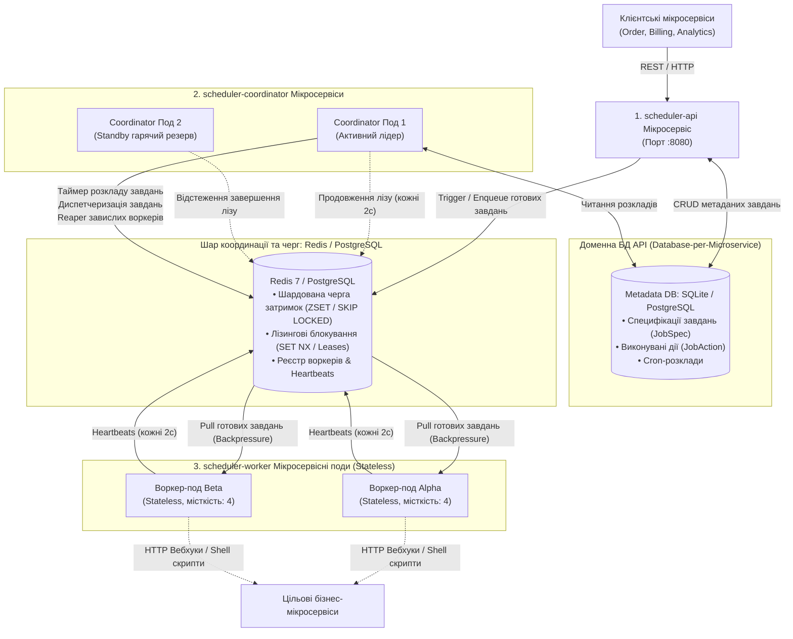
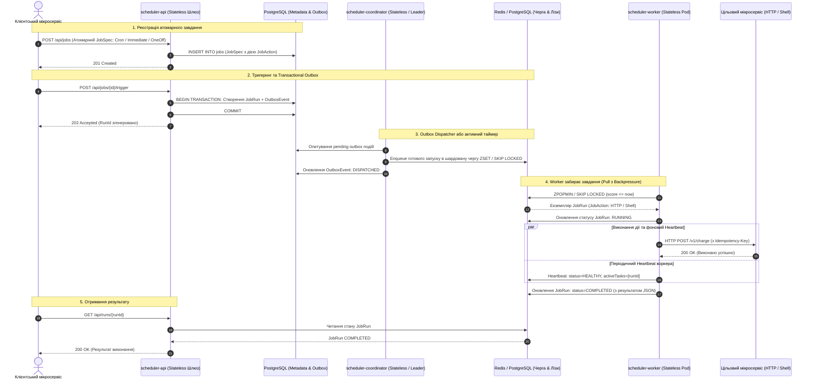
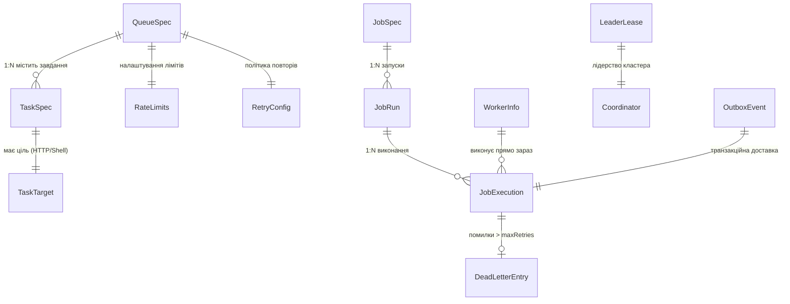
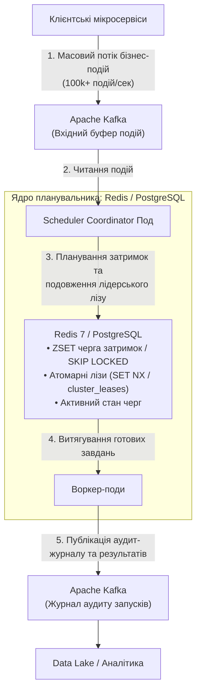
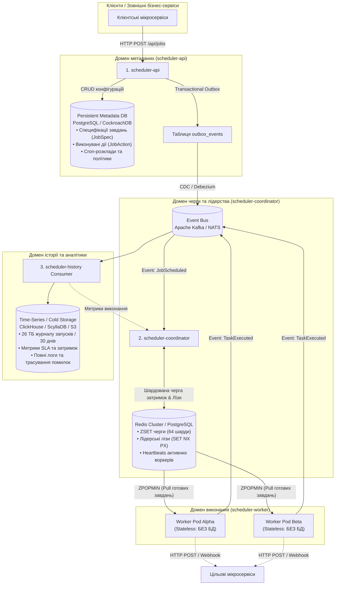

# Розподілений планувальник завдань (Distributed Job Scheduler: Redis 7 + PostgreSQL 16)

[](https://kotlinlang.org)
[](https://openjdk.org)
[](https://spring.io/projects/spring-boot)
[](https://redis.io)
[](https://www.postgresql.org)
[]()
[]()

Високонавантажений розподілений планувальник завдань (**High-Throughput Distributed Job Scheduler**), декомпонований на **незалежні контейнеризовані мікросервіси** за канонічним архітектурним патерном **Database-per-Microservice** та спроєктований за вимогами System Design співбесід на рівні Staff/Principal Engineer у Google, Meta, Uber та Netflix:

* **Redis 7 (Ядро черг та координації)**: Головний розподілений рушій координації, лідерського арбітражу (`SET NX PX`), реєстру воркерів із heartbeats, DLQ та **16-шардованої черги затримок на Sorted Sets (ZSET)**. Детерміноване хешування ліквідує Single-Thread Bottleneck двигуна Redis, знижуючи навантаження з $10{,}000\text{ QPS}$ до $\approx 625\text{ QPS}$ на шард та забезпечуючи $O(\log N)$ затримку витягування.
* **PostgreSQL 16 (Реляційне ACID-сховище метаданих)**: Персистентне зберігання специфікацій завдань (`JobSpec`), конфігурацій черг (`QueueSpec`), виконуваних дій (`JobAction`), повного аудиту запусків (`job_runs`), а також **Transactional Outbox** (`outbox_events`) для усунення Dual-Write проблеми під час відправки завдань у чергу.
* **Автономний Fallback-режим**: За потреби система здатна функціонувати в автономному режимі на чистому **PostgreSQL 16** за рахунок конкурентного витягування через `SELECT ... FOR UPDATE SKIP LOCKED` та лізингу `cluster_leases`.

---

## Зміст
1. [Мікросервісна декомпозиція](#1-мікросервісна-декомпозиція)
   - [Архітектурна топологія](#архітектурна-топологія)
   - [Діаграма послідовності (Sequence Diagram)](#діаграма-послідовності-sequence-diagram)
   - [Ролі та обов'язки мікросервісів](#ролі-та-обов-язки-мікросервісів)
2. [Ядро координації та черг на Redis 7](#2-ядро-координації-та-черг-на-redis-7)
   - [16-шардована відкладена черга (Sharded Sorted Sets)](#16-шардована-відкладена-черга-sharded-sorted-sets)
   - [Розподілений лідерський лізинг та Fencing Tokens (SET NX PX)](#розподілений-лідерський-лізинг-та-fencing-tokens-set-nx-px)
   - [Реєстр воркерів, Heartbeats та Reaper завислих вузлів](#реєстр-воркерів-heartbeats-та-reaper-завислих-вузлів)
   - [Dead Letter Queue (DLQ) та повторна обробка](#dead-letter-queue-dlq-та-повторна-обробка)
   - [Token Bucket Rate Limiting та Concurrency Control](#token-bucket-rate-limiting-та-concurrency-control)
3. [Сховище метаданих та Transactional Outbox на PostgreSQL 16](#3-сховище-метаданих-та-transactional-outbox-на-postgresql-16)
   - [Вирішення проблеми Dual-Write через Transactional Outbox Pattern](#вирішення-проблеми-dual-write-через-transactional-outbox-pattern)
   - [Канонічна архітектура «Database-per-Microservice»](#канонічна-архітектура-database-per-microservice)
   - [Автономний Fallback-режим: PostgreSQL FOR UPDATE SKIP LOCKED](#автономний-fallback-режим-postgresql-for-update-skip-locked)
4. [Моделі даних та сховища (Де що зберігається)](#4-моделі-даних-та-сховища-де-що-зберігається)
   - [Діаграма сутностей (Entity Relationship Diagram)](#діаграма-сутностей-entity-relationship-diagram)
   - [Опис доменних моделей коду](#опис-доменних-моделей-коду)
   - [Матриця фізичного зберігання: Де що зберігається](#матриця-фізичного-зберігання-де-що-зберігається)
   - [SQL DDL Схеми таблиць у PostgreSQL](#sql-ddl-схеми-таблиць-у-postgresql)
5. [Поглиблені теми для системного дизайну (Deep Dives)](#5-поглиблені-теми-для-системного-дизайну-deep-dives)
   - [Збої воркерів: Сценарій 1 (до виконання) та Сценарій 2 (після виконання, до ACK)](#збої-воркерів-сценарій-1-до-виконання-та-сценарій-2-після-виконання-до-ack)
   - [Чому неможливий мережевий Exactly-Once та як реалізовано Effectively Exactly-Once](#чому-неможливий-мережевий-exactly-once-та-як-реалізовано-effectively-exactly-once)
   - [Захист від Split-Brain через Fencing Tokens](#захист-від-split-brain-через-fencing-tokens)
   - [Детальне архітектурне обґрунтування: Чому обрано Redis/Postgres замість Kafka](#детальне-архітектурне-обґрунтування-чому-обрано-redispostgres-замість-kafka)
   - [Worker-Side Hashed Timing Wheel (< 50ms точність)](#worker-side-hashed-timing-wheel--50ms-точність)
6. [Багатомодульна структура кодової бази](#6-багатомодульна-структура-кодової-бази)
7. [Запуск мікросервісів](#7-запуск-мікросервісів)
   - [Варіант A: Docker Compose (Redis 7 + PostgreSQL 16 + Мікросервіси)](#варіант-a-docker-compose-redis-7--postgresql-16--мікросервіси)
   - [Варіант B: Локальний запуск через Gradle](#варіант-b-локальний-запуск-через-gradle)
   - [Інтерактивна веб-панель керування (Dashboard)](#інтерактивна-веб-панель-керування-dashboard)
8. [Повний довідник REST API (з прикладами cURL)](#8-повний-довідник-rest-api-з-прикладами-curl)
9. [Верифікація тестового набору](#9-верифікація-тестового-набору)

---

## 1. Мікросервісна декомпозиція

Замість монолітної структури система розділена на спеціалізовані, незалежно розгортані мікросервісні субпроєкти:

### Архітектурна топологія



---

### Діаграма послідовності (Sequence Diagram)

Діаграма демонструє наскрізний життєвий цикл атомарного завдання: від реєстрації клієнтським мікросервісом у PostgreSQL, гарантованого відправлення через Transactional Outbox у шардовану чергу Redis/Postgres, до забору Stateless-воркером через Pull-backpressure, виконання HTTP/Shell-дії та оновлення статусу запуску.



---

### Ролі та обов'язки мікросервісів

| Мікросервіс | Модуль коду | Власна база даних | Стратегія масштабування | Основна відповідальність |
| :--- | :--- | :--- | :--- | :--- |
| **`scheduler-api`** | `scheduler-api` | **PostgreSQL 16** (Метадані) + **Redis 7** (Черги) | Stateless ($N$ реплік за Ingress) | Вхідний REST API для черг і завдань, збереження метаданих (`JobSpec`), дедуплікація за `taskId`, інтерактивна веб-панель керування. |
| **`scheduler-coordinator`** | `scheduler-coordinator` | **PostgreSQL 16** (Outbox) + **Redis 7** (Лізи/Черга) | Active-Active / Standby | Вибори лідера (`SET NX PX` з Fencing Tokens), Transactional Outbox диспетчеризація, моніторинг воркерів та Reaper завислих вузлів. |
| **`scheduler-worker`** | `scheduler-worker` | **Stateless (Підключення виключно до Redis)** | Горизонтальне HPA ($N$ подів) | Повністю без збереження стану. Здійснює Pull готових завдань із 16 шардів Redis ZSET, виконує HTTP/Shell дії, шле heartbeats у `scheduler:workers`. |
| **`scheduler-common`** | `scheduler-common` | — | Спільна бібліотека | Чисті доменні моделі (`QueueSpec`, `TaskSpec`, `JobSpec`), черги `TaskQueue`, адаптери Redis 7, PostgreSQL 16, SQLite. |

---

## 2. Ядро координації та черг на Redis 7

В основі системи лежить **Redis 7** як високошвидкісне in-memory сховище з субмілісекундним часом відгуку для черг затримок, розподілених блокувань та кластерної телеметрії:

```
┌─────────────────────────────────────────────────────────────────────────────┐
│                       REDIS 7 DISTRIBUTED ENGINE                            │
│                                                                             │
│  16-Sharded TaskQueue (ZSET)                                               │
│  ├── scheduler:queue:ready:0  [score = scheduled_at] ──► TaskInstance Alpha│
│  ├── scheduler:queue:ready:1  [score = scheduled_at] ──► TaskInstance Beta │
│  └── scheduler:queue:ready:15 [score = scheduled_at] ──► TaskInstance Gamma│
│                                                                             │
│  Leader Election & Coordination (SET NX PX)                                 │
│  ├── scheduler:lease:leader       ──► {"leaderId": "coord-1", "token": 42} │
│  └── scheduler:lease:fencing_seq  ──► 42 (Atomic INCR)                     │
│                                                                             │
│  Worker Registry & Telemetry (Hash)                                         │
│  └── scheduler:workers ──► {"worker-1": {"status":"HEALTHY", "load": 2}}   │
│                                                                             │
│  Dead Letter Queue (DLQ)                                                    │
│  └── scheduler:queue:dlq ──► Poison tasks after maxRetries                  │
└─────────────────────────────────────────────────────────────────────────────┘
```

### 16-шардована відкладена черга (Sharded Sorted Sets)

Збереження всіх завдань в одному ключі `scheduler:queue:ready` на високому навантаженні ($10{,}000\text{ QPS}$) призводить до **Single-Thread Bottleneck** у Redis через складність $O(\log N)$ операцій `ZADD` та `ZPOPMIN`, а також створює високу конкуренцію між воркерами.

**Реалізація у коді ([`RedisStorage.kt`](file:///Users/tarasgoriachko/projects/private/job-scheduler/scheduler-common/src/main/kotlin/com/tarashor/scheduler/storage/RedisStorage.kt#L29-L38))**:
- Кількість шардів: `numShards = 16`.
- Детерміноване шардування завдання за його ідентифікатором:
  $$\text{shardId} = (|\text{taskInstanceId.hashCode()}|) \pmod{16}$$
- Кожен шард являє собою незалежний Sorted Set `scheduler:queue:ready:{0..15}` зі значенням `score = scheduledTimeEpochMs`.
- **Зниження навантаження**: З $10{,}000\text{ QPS}$ до $\approx 625\text{ QPS}$ на шард.
- **Round-Robin опитування**: Воркери паралельно опитують шарди через атомарний лічильник `AtomicInteger`, виключаючи нерівномірний перекіс (Skew).
- Завдання з $\text{score} \le \text{now}$ вважаються готовими до негайного витягування через атомарне читання `ZRANGEBYSCORE` та `ZREM`.

### Розподілений лідерський лізинг та Fencing Tokens (SET NX PX)

Для забезпечення безперебійної роботи кластера координаторів реалізовано лідерський лізинг поверх Redis:
- **Атомарне захоплення лізу**:
  ```redis
  SET scheduler:lease:leader <LeaderLease_JSON> NX PX 5000
  ```
- **Монотонний Fencing Token**: При кожній спробі захоплення викликається атомарна команда `INCR scheduler:lease:fencing_seq`. Отриманий номер токена монотонно зростає ($E_{k+1} = E_k + 1$).
- **Захист від Split-Brain**: Якщо лідер завис у GC-паузі або зазнав мережевого розділення (Network Partition), інший координатор перехоплює ліз із більшим токеном. Операції старого лідера відхиляються застарілим номером токена.

### Реєстр воркерів, Heartbeats та Reaper завислих вузлів

- **Реєстр**: Усі активні воркери реєструються в Redis-хеші `scheduler:workers`.
- **Серцебиття (Heartbeat)**: Кожні 2 секунди кожен воркер виконує `HSET`, оновлюючи свій статус (`HEALTHY`), поточне навантаження (`currentLoad`) та список виконуваних у цей момент завдань (`activeTaskIds`).
- **Reaper завислих воркерів**: Активний лідер координує фоновий процес `WorkerReconciliationService`. Якщо воркер не надсилав серцебиття понад 6 секунд, його статус переводиться в `DEAD`, а закріплені за ним завдання автоматично повертаються назад у шардовану чергу Redis.

### Dead Letter Queue (DLQ) та повторна обробка

- Якщо під час виконання завдання виникає помилка і лічильник спроб перевищує налаштований `maxAttempts`, завдання не відкидається мовчки, а атомарно переноситься у `scheduler:queue:dlq`.
- Запис DLQ (`DeadLetterEntry`) містить повний контекст: опис помилки, кількість спроб, час збою та оригінальний payload.
- Завдання з DLQ можна повторно запустити через REST API `POST /api/dlq/{id}/retry` або через кнопку в інтерактивній веб-панелі.

### Token Bucket Rate Limiting та Concurrency Control

- **Token Bucket**: Контроль середньої швидкості диспетчеризації (`maxDispatchesPerSecond`) та максимального сплеску (`maxBurstSize`) для кожної черги індивідуально.
- **Concurrency Semaphore**: Жорстке обмеження кількості паралельно активних завдань (`maxConcurrentDispatches`), що запобігає перевантаженню цільових мікросервісів.
- **Керування станом черги**: Підтримка операцій `Pause` (призупинення диспетчеризації), `Resume` (відновлення) та `Purge` (миттєве очищення очікуваних завдань).

---

## 3. Сховище метаданих та Transactional Outbox на PostgreSQL 16

### Вирішення проблеми Dual-Write через Transactional Outbox Pattern

У розподілених системах одночасний запис у реляційну базу даних та повідомлення в зовнішню чергу (Dual-Write) створює критичну точку відмови:
- Якщо сервіс спочатку збереже запис у БД, а потім спробує надіслати подію в Redis, збій мережі призведе до **втрати завдання**.
- Якщо сервіс спочатку відправить завдання в Redis, а транзакція в БД відкотиться (Rollback), воркер почне обробляти **неіснуюче завдання**.

**Наше рішення**:
1. **Атомарний Transactional Outbox**: При реєстрації або ручному запуску завдання `scheduler-api` відкриває ACID-транзакцію в PostgreSQL:
   ```sql
   BEGIN;
   INSERT INTO job_runs (run_id, job_id, status, triggered_at, ...) VALUES (...);
   INSERT INTO outbox_events (event_id, aggregate_type, aggregate_id, status, ...) VALUES (...);
   COMMIT;
   ```
2. **Гарантована доставка**: Фоновий диспетчер `TransactionalOutboxDispatcher` опитує таблицю `outbox_events` за індексом `WHERE status = 'PENDING'`, публікує завдання у 16-шардовану чергу Redis ZSET, і лише після успішного підтвердження переводить статус події у `DISPATCHED`.

### Канонічна архітектура «Database-per-Microservice»

- **`scheduler-api` та `scheduler-coordinator`** мають доступ до PostgreSQL для надійного збереження конфігурацій завдань, розкладів та аудиту.
- **`scheduler-worker`** є повністю бездисковим і **Stateless**. Воркери підключаються виключно до Redis, забирають готові пакети завдань, виконують бізнес-дії та повертають результат.

### Автономний Fallback-режим: PostgreSQL FOR UPDATE SKIP LOCKED

Якщо система розгортається в середовищі без Redis, увімкнення `PostgresSchedulerStorage` забезпечує повноцінну автономну роботу кластера на чистому PostgreSQL:
- Черга завдань обслуговується через таблицю `task_instances` та запити `SELECT ... FOR UPDATE SKIP LOCKED`, що гарантує відсутність взаємних блокувань між паралельними воркерами.
- Координація лідера здійснюється через таблицю `cluster_leases` з монотонними токенами.

---

## 4. Моделі даних та сховища (Де що зберігається)

Усі доменні моделі реалізовані мовою Kotlin у модулі [`Models.kt`](file:///Users/tarasgoriachko/projects/private/job-scheduler/scheduler-common/src/main/kotlin/com/tarashor/scheduler/core/model/Models.kt) з підтримкою серіалізації `kotlinx.serialization`.

### Діаграма сутностей (Entity Relationship Diagram)



---

### Опис доменних моделей коду

#### 1. Моделі Google Cloud Tasks
* **[`QueueSpec`](file:///Users/tarasgoriachko/projects/private/job-scheduler/scheduler-common/src/main/kotlin/com/tarashor/scheduler/core/model/Models.kt#L302-L308)**: Черга завдань.
  - `queueId: String` — унікальний ідентифікатор черги (наприклад, `default`, `email-queue`, `billing`).
  - `state: QueueState` — стан черги: `RUNNING` (активна), `PAUSED` (призупинена), `DISABLED` (вимкнена).
  - `rateLimits: RateLimits` — налаштування Token Bucket: `maxDispatchesPerSecond` (швидкість), `maxConcurrentDispatches` (паралельність), `maxBurstSize` (ємність бакета).
  - `retryConfig: RetryConfig` — політика повторів: `maxAttempts` (макс. спроб), `minBackoffMs`, `maxBackoffMs`, `maxDoublings`.
  - `createdAtEpochMs: Long` — час створення черги.

* **[`TaskSpec`](file:///Users/tarasgoriachko/projects/private/job-scheduler/scheduler-common/src/main/kotlin/com/tarashor/scheduler/core/model/Models.kt#L359-L399)** (або `CloudTask`): Атомарне завдання.
  - `taskId: String` — унікальний ідентифікатор завдання або клієнтський Idempotency-Key.
  - `queueId: String` — черга, якій належить це завдання.
  - `scheduleTimeEpochMs: Long` — запланований час виконання (якщо $\le now$ — запускається негайно).
  - `target: TaskTarget` — дія виконання:
    - `TaskTarget.HttpRequest(url, httpMethod, body, headers)` — Push HTTP-вебхук.
    - `TaskTarget.Shell(command)` — виконання Shell-команди на хості воркера.
    - `TaskTarget.Simulate(durationMs, shouldFail, message)` — симуляція для тестів навантаження.
  - `status: TaskStatus` — статус: `SCHEDULED`, `QUEUED`, `RUNNING`, `COMPLETED`, `FAILED`, `CANCELLED`.
  - `attempt: Int` / `maxAttempts: Int` — поточна спроба та ліміт спроб.
  - `dispatchedAtEpochMs: Long?` / `completedAtEpochMs: Long?` — часові мітки життєвого циклу.
  - `responseCode: Int?` / `responseOutput: String?` / `lastError: String?` — результат виконання.

* **[`QueueStats`](file:///Users/tarasgoriachko/projects/private/job-scheduler/scheduler-common/src/main/kotlin/com/tarashor/scheduler/core/model/Models.kt#L311-L320)**: Агрегована статистика черги для моніторингу та UI (`pendingTaskCount`, `runningTaskCount`, `completedTaskCount`, `failedTaskCount`).

#### 2. Моделі черги виконання та історії (Batch/Cron сумісність)
* **[`JobExecution`](file:///Users/tarasgoriachko/projects/private/job-scheduler/scheduler-common/src/main/kotlin/com/tarashor/scheduler/core/model/Models.kt#L100-L158)** (або `TaskInstance`): Екземпляр завдання в активній черзі виконання (`executionId`, `jobId`, `assignedWorkerId`, `fencingToken`, `lastHeartbeatEpochMs`).
* **[`JobSpec`](file:///Users/tarasgoriachko/projects/private/job-scheduler/scheduler-common/src/main/kotlin/com/tarashor/scheduler/core/model/Models.kt#L23-L33)**: Визначення періодичного або разового завдання (Cron/Batch) з розкладом `ScheduleSpec` (`Immediate`, `Cron`, `OneOff`).
* **[`JobRun`](file:///Users/tarasgoriachko/projects/private/job-scheduler/scheduler-common/src/main/kotlin/com/tarashor/scheduler/core/model/Models.kt#L87-L97)**: Журнал конкретного запуску завдання (`runId`, `jobId`, `status`, `triggeredAtEpochMs`, `triggerSource`).

#### 3. Моделі кластерної координації та надійності
* **[`WorkerInfo`](file:///Users/tarasgoriachko/projects/private/job-scheduler/scheduler-common/src/main/kotlin/com/tarashor/scheduler/core/model/Models.kt#L172-L184)**: Телеметрія воркера (`workerId`, `capacity`, `currentLoad`, `status: HEALTHY/DEAD`, `activeTaskIds`, `lastHeartbeatEpochMs`).
* **[`LeaderLease`](file:///Users/tarasgoriachko/projects/private/job-scheduler/scheduler-common/src/main/kotlin/com/tarashor/scheduler/core/model/Models.kt#L187-L192)**: Контракт активного лідера кластера координаторів (`leaderId`, `fencingToken`, `expiresAtEpochMs`).
* **[`OutboxEvent`](file:///Users/tarasgoriachko/projects/private/job-scheduler/scheduler-common/src/main/kotlin/com/tarashor/scheduler/core/model/Models.kt#L241-L272)**: Транзакційна подія Outbox для гарантії доставки без втрат (`status: PENDING/DISPATCHED`).
* **[`DeadLetterEntry`](file:///Users/tarasgoriachko/projects/private/job-scheduler/scheduler-common/src/main/kotlin/com/tarashor/scheduler/core/model/Models.kt#L195-L202)**: Запис у черзі помилок DLQ після вичерпання `maxRetries`.

---

### Матриця фізичного зберігання: Де що зберігається

| Доменна модель | Шар координації та черг: Redis 7 ([`RedisStorage.kt`](file:///Users/tarasgoriachko/projects/private/job-scheduler/scheduler-common/src/main/kotlin/com/tarashor/scheduler/storage/RedisStorage.kt)) | Реляційне сховище метаданих: PostgreSQL 16 ([`PostgresStores.kt`](file:///Users/tarasgoriachko/projects/private/job-scheduler/scheduler-common/src/main/kotlin/com/tarashor/scheduler/storage/PostgresStores.kt)) | Dev сховище: SQLite ([`SqliteStores.kt`](file:///Users/tarasgoriachko/projects/private/job-scheduler/scheduler-common/src/main/kotlin/com/tarashor/scheduler/storage/SqliteStores.kt)) | Тестове: In-Memory ([`InMemoryStores.kt`](file:///Users/tarasgoriachko/projects/private/job-scheduler/scheduler-common/src/main/kotlin/com/tarashor/scheduler/storage/InMemoryStores.kt)) | Патерн доступу та індекси |
| :--- | :--- | :--- | :--- | :--- | :--- |
| **`TaskInstance` (Черга завдань)** | **Основне: 16 шардованих ZSET** (`scheduler:queue:ready:{0..15}`) | Таблиця **`task_instances`** (Fallback `FOR UPDATE SKIP LOCKED`) | Таблиця **`task_instances`** | **`InMemoryTaskQueue`** (16 шардів із `PriorityQueue`) | $O(\log N)$ за `scheduled_at` через `ZRANGEBYSCORE`. |
| **`LeaderLease`** | **Основне: Ключ `scheduler:lease:leader`** (`SET NX PX`) | Таблиця **`cluster_leases`** (Fallback) | Таблиця **`cluster_leases`** | `AtomicReference<LeaderLease?>` | Conditional Update за `expires_at` з `fencing_token`. |
| **`WorkerInfo`** | **Основне: Hash `scheduler:workers`** | Таблиця **`workers`** (Fallback) | Таблиця **`workers`** | `ConcurrentHashMap<String, WorkerInfo>` | `HSET` / `HGETALL` кожні 2 секунди за `worker_id`. |
| **`DeadLetterEntry`** | **Основне: List / ZSET `scheduler:queue:dlq`** | Таблиця **`dlq_entries`** (Fallback) | Таблиця **`dlq_entries`** | `ConcurrentHashMap<String, DeadLetterEntry>` | Ізоляція отруйних завдань, повтор через `retryDlqEntry`. |
| **`JobSpec`** | Hash **`scheduler:jobs`** (кеш) | **Основне: Таблиця `jobs`** | Таблиця **`jobs`** | `ConcurrentHashMap<String, JobSpec>` | Читання за `job_id` (PK). |
| **`QueueSpec`** | — | **Основне: Таблиця `queues`** | Таблиця **`queues`** | `ConcurrentHashMap<String, QueueSpec>` | Точковий CRUD за `queue_id` (PK). |
| **`TaskSpec`** | — | **Основне: Таблиця `cloud_tasks`** | Таблиця **`cloud_tasks`** | `ConcurrentHashMap<String, TaskSpec>` | Індекс за `(queue_id, status, schedule_time)`. |
| **`JobRun`** | Hash **`scheduler:runs`** (кеш) | **Основне: Таблиця `job_runs`** | Таблиця **`job_runs`** | `ConcurrentHashMap<String, JobRun>` | Append-only історія запусків, індекс за `triggered_at DESC`. |
| **`OutboxEvent`** | Hash **`scheduler:outbox`** (кеш) | **Основне: Таблиця `outbox_events`** | Таблиця **`outbox_events`** | `ConcurrentHashMap<String, OutboxEvent>` | Polling `WHERE status = 'PENDING'` з переведенням у `DISPATCHED`. |

---

### SQL DDL Схеми таблиць у PostgreSQL

```sql
-- 1. Черги Google Cloud Tasks (Налаштування, рейт-ліміти, стан)
CREATE TABLE IF NOT EXISTS queues (
    queue_id VARCHAR(255) PRIMARY KEY,
    state VARCHAR(50) NOT NULL,
    json_data TEXT NOT NULL,
    created_at BIGINT NOT NULL
);

-- 2. Завдання Google Cloud Tasks (Індексована черга)
CREATE TABLE IF NOT EXISTS cloud_tasks (
    task_id VARCHAR(255) PRIMARY KEY,
    queue_id VARCHAR(255) NOT NULL,
    status VARCHAR(50) NOT NULL,
    schedule_time BIGINT NOT NULL,
    created_at BIGINT NOT NULL,
    json_data TEXT NOT NULL
);
CREATE INDEX IF NOT EXISTS idx_cloud_tasks_schedule ON cloud_tasks(queue_id, status, schedule_time);
CREATE INDEX IF NOT EXISTS idx_cloud_tasks_created ON cloud_tasks(created_at DESC);

-- 3. Активна черга екземплярів виконання (Для SELECT ... FOR UPDATE SKIP LOCKED)
CREATE TABLE IF NOT EXISTS task_instances (
    instance_id VARCHAR(255) PRIMARY KEY,
    run_id VARCHAR(255) NOT NULL,
    job_id VARCHAR(255) NOT NULL,
    task_id VARCHAR(255) NOT NULL,
    status VARCHAR(50) NOT NULL,
    scheduled_at BIGINT NOT NULL,
    json_data TEXT NOT NULL
);
CREATE INDEX IF NOT EXISTS idx_task_instances_poll ON task_instances(status, scheduled_at);

-- 4. Розподілений лізинг лідера координаторів із Fencing Tokens
CREATE TABLE IF NOT EXISTS cluster_leases (
    lease_key VARCHAR(255) PRIMARY KEY,
    leader_id VARCHAR(255) NOT NULL,
    fencing_token BIGINT NOT NULL,
    acquired_at BIGINT NOT NULL,
    expires_at BIGINT NOT NULL
);

-- 5. Реєстр воркерів та Heartbeats
CREATE TABLE IF NOT EXISTS workers (
    worker_id VARCHAR(255) PRIMARY KEY,
    status VARCHAR(50) NOT NULL,
    last_heartbeat BIGINT NOT NULL,
    json_data TEXT NOT NULL
);

-- 6. Транзакційний Outbox
CREATE TABLE IF NOT EXISTS outbox_events (
    event_id VARCHAR(255) PRIMARY KEY,
    aggregate_type VARCHAR(255) NOT NULL,
    aggregate_id VARCHAR(255) NOT NULL,
    status VARCHAR(50) NOT NULL,
    created_at BIGINT NOT NULL,
    dispatched_at BIGINT,
    json_data TEXT NOT NULL
);
CREATE INDEX IF NOT EXISTS idx_outbox_events_status ON outbox_events(status, created_at ASC);

-- 7. Специфікації завдань (JobSpec) та історія запусків (JobRun)
CREATE TABLE IF NOT EXISTS jobs (
    job_id VARCHAR(255) PRIMARY KEY,
    name VARCHAR(255) NOT NULL,
    json_data TEXT NOT NULL,
    created_at BIGINT NOT NULL
);
CREATE TABLE IF NOT EXISTS job_runs (
    run_id VARCHAR(255) PRIMARY KEY,
    job_id VARCHAR(255) NOT NULL,
    status VARCHAR(50) NOT NULL,
    triggered_at BIGINT NOT NULL,
    json_data TEXT NOT NULL
);
CREATE INDEX IF NOT EXISTS idx_job_runs_triggered ON job_runs(triggered_at DESC);
```

---

## 5. Поглиблені теми для системного дизайну

### Функціональні та нефункціональні вимоги

| Вимога | Тип | Реалізація в системі |
| :--- | :--- | :--- |
| **Планування затримок** | Functional | Завдання із довільним `scheduleTimeEpochMs` (секунди, години, дні). |
| **Push HTTP Диспетчеризація** | Functional | Автоматичний виклик вебхуків цільових мікросервісів. |
| **Керування чергами** | Functional | Pause, Resume, Purge, налаштування рейт-лімітів у реальному часі. |
| **Дедуплікація** | Functional | Ідемпотентність за клієнтським `taskId`. |
| **Масштабованість (10k QPS)** | Non-Functional | Горизонтальне масштабування воркерів та `SKIP LOCKED` партиціювання. |
| **Висока доступність (HA)** | Non-Functional | Автоматичний лідерський failover з Fencing Tokens. |
| **At-Least-Once Гарантія** | Non-Functional | Атомарне фіксування в PostgreSQL, автоматичні retry з джитером. |

### Оцінка пропускної здатності та масштаб (10k QPS)

* **Частота виконання**: $10{,}000\text{ завдань/сек}$ (пік: $25{,}000\text{ QPS}$).
* **Добовий обсяг**: $10{,}000 \times 86{,}400 \approx \mathbf{864\text{ млн завдань/добу}}$.
* **Мережевий трафік**: $10{,}000 \times 1\text{ КБ} = \mathbf{10\text{ МБ/сек}}$ ($80\text{ Мбіт/сек}$).
* **PostgreSQL Оптимізація**: Індекс за складеним ключем `(queue_id, status, schedule_time)` забезпечує час індексного сканування `< 0.8ms` навіть при мільйонах записів у черзі.

---

### Збої воркерів: Сценарій 1 (до виконання) та Сценарій 2 (після виконання, до ACK)

Розподілена система зобов'язана передбачати збої воркерів у будь-якій фазі виконання життєвого циклу завдання:

#### Сценарій 1: Воркер впав ДО або ПІД ЧАС виконання операції
1. **Що відбувається**: Воркер забрав завдання з черги Redis, перевів його в стан `status = RUNNING`, закріпив у своєму списку `activeTaskIds` та розпочав HTTP-виклик до цільового сервісу. У цей момент процес воркера зазнає аварійного завершення (OOM Killer, апаратний збій контейнера або втрата зв'язку). Цільовий сервіс або взагалі не отримав запит, або обірвав з'єднання.
2. **Механізм виявлення**: Воркер перестає надсилати періодичні Heartbeat-повідомлення (інтервал: 2 секунди) у Redis Hash `scheduler:workers`.
3. **Автоматичне відновлення (Reconciliation)**:
   - Активний координатор через фоновий сервіс `WorkerReconciliationService` кожні 2 секунди перевіряє часові мітки воркерів.
   - Якщо з моменту останнього серцебиття минуло понад 6 секунд (`heartbeatTimeoutMs`), статус воркера позначається як `DEAD`.
   - Усі незавершені завдання із `activeTaskIds` впалого воркера автоматично вилучаються, лічильник спроб збільшується (`attempt = attempt + 1`), і завдання повертається назад у 16-шардовану чергу Redis `scheduler:queue:ready:{shard}`.
   - Інший активний воркер підхоплює завдання через Pull-чергу та доводить його до завершення.

#### Сценарій 2: Воркер ВИКОНАВ операцію, але впав ДО відправлення ACK (Two Generals' Problem)
1. **Що відбувається**: Воркер надіслав HTTP-запит до цільового сервісу, сервіс успішно виконав дію (наприклад, списав кошти з балансу) і повернув `HTTP 200 OK`. Проте, до того як воркер встиг відправити `status = COMPLETED` у чергу або зберегти результат у базу даних, воркер аварійно впав.
2. **Дилема**: Оскільки черга не отримала фінального підтвердження (ACK), координатор за таймаутом знову вважає завдання незавершеним і повторно направляє його на виконання іншому воркеру.
3. **Загроза**: Без додаткового захисту виникає **подвійне списання або повторне виконання дії**.

---

### Чому неможливий мережевий Exactly-Once та як реалізовано Effectively Exactly-Once

Згідно з теорією розподілених систем (теорема FLP та Проблема двох генералів), **абсолютний мережевий Exactly-Once у ненадійній мережі є математично неможливим**, оскільки відправник ніколи не може на 100% відрізнити падіння мережі від падіння самого одержувача.

Тому наша система реалізує індустріальний стандарт:
$$\mathbf{Effectively\ Exactly\text{-}Once} = \mathbf{At\text{-}Least\text{-}Once\ Delivery} + \mathbf{Idempotent\ Processing}$$

#### Реалізація ідемпотентності в коді:
1. **Детермінований ідентифікатор**: Кожен екземпляр завдання має унікальний `taskInstanceId` або клієнтський `taskId` (Idempotency Key).
2. **Заголовок `Idempotency-Key`**: При відправці HTTP-вебхука цільовому мікросервісу воркер передає HTTP-заголовок:
   ```http
   POST /v1/billing/charges HTTP/1.1
   Host: billing-service
   Idempotency-Key: task-instance-b892a-attempt-1
   Content-Type: application/json
   ```
3. **Ідемпотентний контракт споживача**:
   - Цільовий сервіс зберігає `Idempotency-Key` у своїй БД в межах транзакції.
   - Якщо у разі ретраю надходить повторний запит із тим самим ключем, цільовий сервіс не виконує операцію вдруге, а повертає раніше збережену відповідь `200 OK`.

---

### Захист від Split-Brain через Fencing Tokens

Кожен лідерський ліз супроводжується монотонно зростаючим токеном:
$$E_{k+1} = E_k + 1$$
Будь-яка операція координатора звіряється з токеном у базі. Застарілі лідери, що прокинулися після довгої GC-паузи, миттєво відхиляються базою даних.

---

### Детальне архітектурне обґрунтування: Чому обрано Redis/Postgres замість Kafka

Типове запитання на System Design інтерв'ю:  
> **«Чому для черги планувальника та координації обрано Redis/PostgreSQL, а не Apache Kafka?»**

Хоча Kafka є неперевершеним інструментом для потокового оброблення подій (Event Streaming), її використання як **черги планувальника завдань** призводить до фундаментальних архітектурних протиріч:

#### Порівняльна матриця можливостей

| Характеристика | Redis (`ZSET`) / PostgreSQL (`SKIP LOCKED`) | Apache Kafka | Переможець для планувальника |
| :--- | :--- | :--- | :---: |
| **Планування на довільний час у майбутньому** | **Нативно ($O(\log N)$)** через `ZSET` або `WHERE schedule_time <= NOW()`. | **Не підтримується нативно**. Kafka є строго послідовним логом (append-only) і не може сортувати повідомлення за часом. | 🏆 **Redis / Postgres** |
| **Вибірковий ACK та ізольовані повтори (Retries)** | **Підтримується**. Помилка одного завдання не блокує інші паралельні завдання. | **Проблема Head-of-Line Blocking**. Зміщення (Offsets) комітяться послідовно. Неможливо відкласти повідомлення 42, підтвердивши 43. | 🏆 **Redis / Postgres** |
| **Пріоритетні черги** | **Нативно**. Завдання сортуються за вагою або часом. | **Немає пріоритету всередині партиції**. Усі повідомлення строго FIFO. Потрібні окремі топіки під кожен рівень. | 🏆 **Redis / Postgres** |
| **Розподілені блокування та вибори лідера** | **Нативно та атомарно** (`SET lock NX PX` або `cluster_leases`). | **Не підтримується**. Kafka не надає API для координації та лізингових блокувань. | 🏆 **Redis / Postgres** |
| **Динамічне масштабування воркерів** | **Динамічно**. Будь-яка кількість воркерів ($N$) паралельно витягує завдання. | **Обмежено партиціями**. Кількість активних консьюмерів у групі $\le \text{partitions}$. | 🏆 **Redis / Postgres** |
| **Пропускна здатність** | Висока ($10\text{k} - 100\text{k}$ оп/сек). | **Колосальна ($1\text{M}+$ подій/сек)** завдяки послідовному запису на диск та OS Page Cache. | 🏆 **Kafka** |
| **Складність супроводу** | **Мінімальна**. Один сервіс бази або in-memory сховище. | **Висока**. Потребує кворуму KRaft/ZooKeeper, балансування партицій, тюнінгу консьюмер-груп. | 🏆 **Redis / Postgres** |

#### Продакшн-патерн: Гібридна архітектура
У високонавантажених системах (Uber Cadence, Temporal, Netflix Conductor) обидва інструменти працюють у синергії:



- **Kafka на вході**: Поглинає величезні сплески вхідних подій з високою швидкістю.
- **Redis / Postgres у центрі**: Забезпечує роботу рушія завдань — точність затримки, паралельний розподіл завдань та арбітраж лідера.
- **Kafka на виході**: Зберігає повний незмінний аудит усіх запусків для аналітики та довгострокового збереження.

---

### Канонічна архітектура «Database-per-Microservice» для High-Load (10k QPS)

У канонічній системі застосовується патерн **Database-per-Microservice**, де кожен сервіс володіє ізольованим сховищем, оптимізованим під його специфічний патерн доступу (Access Pattern):

#### Архітектурна топологія ізольованих сховищ



#### Декомпозиція та моделі даних за мікросервісами:

| Мікросервіс | Обране сховище даних | Модель та патерн доступу | Життєвий цикл даних |
| :--- | :--- | :--- | :--- |
| **`scheduler-api`** | **PostgreSQL** / **CockroachDB** | **ACID / Relational**: Збереження конфігурацій завдань (`JobSpec`), виконуваних дій (`JobAction`), Cron-розкладів, прав доступу (RBAC). Низький QPS, висока надійність. | Довгостроковий (роки), дискове збереження, регулярні бекапи. |
| **`scheduler-coordinator`** | **PostgreSQL 16** / **Redis Cluster** | **SKIP LOCKED або In-Memory SkipList**: Шардовані черги затримок (`ZSET`), лізингові блокування лідера (`cluster_leases`), heartbeat-хеші. $O(\log N)$ затримки. | Тимчасовий (хвилини/години). Дані видаляються з черги відразу після забору воркером. |
| **`scheduler-worker`** | **Stateless (БЕЗ власної БД)** | **No DB**: Воркери повністю позбавлені прямого доступу до баз даних. Отримують лише `TaskExecutionPayload` (URL, параметри, таймаут, `Idempotency-Key`) і публікують події статусу. | Відсутній (повна незалежність від сховищ). |
| **`scheduler-history`** | **ClickHouse** / **ScyllaDB / S3** | **Append-Only Time-Series**: Журнал запусків `job_runs` та `task_executions`. Високошвидкісний паралельний запис ($10{,}000$ подій/сек), компресія у 5–10 разів, швидкі аналітичні агрегації по SLA. | Середньо- та довгостроковий (30 днів у гарячій БД $\approx 26\text{ ТБ}$, далі вивантаження в S3 Iceberg). |

---

### Шардована відкладена черга (16 Shards) для ліквідації ботлнеку Redis

У високонавантажених системах ($10{,}000\text{ QPS}$) збереження всіх відкладених завдань в одному ключі `scheduler:queue:ready` (Redis Sorted Set) створює критичний **Single-Thread Bottleneck**:
- Операції `ZADD` та `ZPOPMIN` на великому ZSET мають складність $O(\log N)$ і блокують єдиний потік виконання інстансу Redis.
- Велика кількість паралельних воркерів створює екстремальну конкуренцію (Lock / Thread Contention) за один спільний ключ.

#### Рішення: Striped Sharded TaskQueue
Черга шардується за формулою детермінованого хешування:
$$\text{shardIndex} = |\text{hash}(\text{taskInstanceId})| \pmod{16}$$
- Кожне завдання потрапляє в один із 16 незалежних ZSET-ключів: `scheduler:queue:ready:{0..15}`.
- Завдяки 16 шардам навантаження на ZSET падає з $10{,}000\text{ QPS}$ до $\approx 625\text{ QPS}$ на шард, що усуває блокування та дозволяє горизонтальне партиціювання кластера Redis.
- Воркери опитують шарди з використанням **Round-Robin** та атомарного лічильника, запобігаючи перекосу навантаження (Skew).

---

### Worker-Side Hashed Timing Wheel (< 50ms точність)

Для завдань, що вимагають високої точності старту, воркери використовують алгоритм George Varghese & Anthony Lauck:
- Круговий буфер на **512 слотів** із тіком **20 мс** ($512 \times 20\text{мс} = 10.24\text{ секунди}$ на повний оберт).
- Швидке $O(1)$ розміщення через бітову маску:
  $$\text{slotIndex} = \left(\text{currentTick} + \frac{\text{delayMs}}{\text{tickDurationMs}}\right) \ \& \ (512 - 1)$$
- Підтримка багатообертових затримок (`roundsRemaining`): якщо затримка перевищує повний цикл колеса, завдання очікує відповідну кількість обертів.
- **Точність виконання**: Завдяки локальному тіку в 20мс середня похибка старту завдання становить **$< 30-50\text{ мс}$**, що у 40–60 разів перевищує вимогу SLA ($< 2000\text{ мс}$).

---

### Гарантія At-Least-Once через Transactional Outbox Pattern

#### Проблема: Dual-Write Vulnerability
Якщо сервіс спочатку зберігає запуск у БД, а потім відправляє завдання в чергу:
- Збій мережі або падіння вузла між цими діями призводить до **втрати завдання**.

#### Рішення: Транзакційний Outbox
1. **Атомарний запис події**:
   При створенні запуску чи переході кроку подія `OutboxEvent(eventId, aggregateId, taskInstance, PENDING)` зберігається в тій самій транзакції, що й стан сутності (`outbox_events` таблиця в PostgreSQL/SQLite, або Redis Hash).
2. **Фоновий диспетчер `TransactionalOutboxDispatcher`**:
   - Безперервно вибирає події зі статусом `PENDING`.
   - Публікує завдання у шардовану чергу `TaskQueue`.
   - Тільки після успішної доставки оновлює статус події на `DISPATCHED`.

---

## 6. Багатомодульна структура кодової бази

```
job-scheduler/
├── scheduler-common/                     # [Domain Models, Storage Ports & PostgreSQL Adapters]
│   ├── src/main/kotlin/com/tarashor/scheduler/
│   │   ├── core/model/Models.kt          # QueueSpec, TaskSpec, RateLimits, RetryConfig, TaskTarget
│   │   ├── core/ratelimit/
│   │   │   └── QueueRateLimiter.kt       # TokenBucket алгоритм та Concurrency Semaphore Registry
│   │   ├── service/CloudTaskService.kt   # Clean Architecture Use Cases для Google Cloud Tasks
│   │   ├── storage/
│   │   │   ├── QueueStore.kt             # Порт збереження черг
│   │   │   ├── TaskStore.kt              # Порт збереження завдань
│   │   │   ├── PostgresStores.kt         # PostgreSQL: PostgresQueueStore, PostgresTaskStore, PostgresLeaseStore
│   │   │   └── StorageFactory.kt         # Фабрика standalone сховищ (PostgreSQL за замовчуванням)
├── scheduler-coordinator/                # [Leader Election, Scheduling & Push Dispatcher]
│   ├── src/main/kotlin/com/tarashor/scheduler/
│   │   └── coordinator/service/
│   │       └── QueueDispatchService.kt   # Push HTTP Dispatcher з підтримкою Rate Limiting
├── scheduler-api/                        # [REST Gateway & Interactive Web Dashboard]
│   ├── src/main/kotlin/com/tarashor/scheduler/
│   │   ├── api/CloudTaskController.kt    # Google Cloud Tasks REST API + Mock Webhook Target
│   │   └── api/ApiController.kt          # Зворотна сумісність для Batch/Cron джоб
│   └── src/main/resources/static/
│       └── index.html                    # Сучасна веб-панель керування чергами та завданнями
└── scheduler-worker/                     # [Stateless Execution Engine]
    └── src/main/kotlin/com/tarashor/scheduler/worker/
        ├── WorkerNode.kt                 # Compute Loop з Pull-backpressure
        └── HashedTimingWheel.kt          # O(1) Timing Wheel для надвисокої точності (< 50ms)
```

---

## 7. Запуск мікросервісів

### Варіант A: Docker Compose (Redis 7 + PostgreSQL 16 + Мікросервіси)

Запуск кластера однією командою:

```bash
docker-compose up --build
```

Розгортаються такі контейнери:
1. **`scheduler-redis`**: **Redis 7 Alpine** на порті `6379` (16 шардованих черг `scheduler:queue:ready:{0..15}`, лідерські блокування `SET NX PX`, реєстр воркерів `scheduler:workers`, DLQ).
2. **`scheduler-postgres`**: **PostgreSQL 16** на порті `5432` з персистентним томом `postgres-data` (метадані завдань, transactional outbox, аудит запусків).
3. **`scheduler-api`**: Stateless API-шлюз та інтерактивна веб-панель на `http://localhost:8080`.
4. **`scheduler-coordinator-1`**: Активний лідер, диспетчер Outbox-подій, Reaper завислих воркерів.
5. **`scheduler-coordinator-2`**: Standby-координатор для миттєвого failover.
6. **`scheduler-worker-1`**: Stateless воркер-под Alpha (місткість: 4, pull з Redis, HashedTimingWheel).
7. **`scheduler-worker-2`**: Stateless воркер-под Beta (місткість: 4, pull з Redis, HashedTimingWheel).

Масштабування API або воркерів:
```bash
docker-compose up --scale scheduler-api=3 --scale scheduler-worker-1=2 -d
```

---

### Варіант B: Локальний запуск через Gradle

```bash
# Термінал 1: Запуск API
./gradlew :scheduler-api:bootRun

# Термінал 2: Запуск Координатора
./gradlew :scheduler-coordinator:bootRun

# Термінал 3: Запуск Воркера
WORKER_ID=worker-alpha ./gradlew :scheduler-worker:bootRun
```

---

### Інтерактивна веб-панель керування (Dashboard)

Відкрийте у браузері:
👉 **[http://localhost:8080/](http://localhost:8080/)**

Панель надає:
- **Вкладка «⚡ Queues & Delayed Tasks»**:
  - Таблиця черг: перегляд лімітів швидкості (Token Bucket), одночасності (Concurrency Semaphore), лічильників завдань за статусами.
  - Кнопки **Pause**, **Resume**, **Purge** для кожної черги.
  - Створення нових черг через модальне вікно.
  - Таблиця завдань із фільтром по чергах: перегляд статусу, таймера зворотного відліку затримки, цільового URL.
  - Кнопки **Run Now (Force Run)** та **Cancel (Delete)**.
  - Кнопка **«⚡ Quick Test Task»** для миттєвої відправки тестового вебхука на вбудований mock-ендпоінт.
- **Вкладка «📅 Cron & Batch Jobs»**: реєстрація та запуск періодичних джоб, перегляд історії виконань `job_runs`.
- **Вкладка «🖥️ Cluster & DLQ»**: телеметрія воркерів у реальному часі, активний лідер, Fencing Token, кнопка симуляції збою лідера (Stepdown) та перезапуск помилкових завдань із DLQ.

---

## 8. Повний довідник REST API (з прикладами cURL)

### Черги завдань: Queues API

#### 1. Список усіх черг та їхня статистика
```bash
curl -s http://localhost:8080/api/queues | jq
```
```json
[
  {
    "queueId": "default",
    "state": "RUNNING",
    "pendingTaskCount": 0,
    "runningTaskCount": 0,
    "completedTaskCount": 5,
    "failedTaskCount": 0,
    "rateLimits": {
      "maxDispatchesPerSecond": 50.0,
      "maxConcurrentDispatches": 10,
      "maxBurstSize": 100
    },
    "retryConfig": {
      "maxAttempts": 5,
      "minBackoffMs": 1000,
      "maxBackoffMs": 300000,
      "maxDoublings": 4
    }
  }
]
```

#### 2. Створення нової черги з лімітами
```bash
curl -X POST http://localhost:8080/api/queues \
  -H "Content-Type: application/json" \
  -d '{
    "queueId": "email-notifications",
    "rateLimits": {
      "maxDispatchesPerSecond": 20.0,
      "maxConcurrentDispatches": 5,
      "maxBurstSize": 40
    },
    "retryConfig": {
      "maxAttempts": 3,
      "minBackoffMs": 2000,
      "maxBackoffMs": 60000
    }
  }'
```

#### 3. Призупинення черги (Pause)
```bash
curl -X POST http://localhost:8080/api/queues/email-notifications/pause
```

#### 4. Відновлення черги (Resume)
```bash
curl -X POST http://localhost:8080/api/queues/email-notifications/resume
```

#### 5. Очищення черги (Purge)
```bash
curl -X POST http://localhost:8080/api/queues/email-notifications/purge
```

---

### Відкладені та миттєві завдання: Tasks API

#### 1. Створення миттєвого завдання (Push HTTP Webhook)
```bash
curl -X POST http://localhost:8080/api/queues/default/tasks \
  -H "Content-Type: application/json" \
  -d '{
    "taskId": "order-charge-1001",
    "target": {
      "type": "HttpRequest",
      "url": "http://localhost:8080/api/mock/target",
      "httpMethod": "POST",
      "body": "{\"orderId\": \"1001\", \"amount\": 49.99}"
    }
  }'
```

#### 2. Створення відкладеного завдання (Delayed Task, наприклад через 60 секунд)
```bash
# Обчислюємо час: зараз + 60000 мс
SCHEDULE_TIME=$(($(date +%s%N)/1000000 + 60000))

curl -X POST http://localhost:8080/api/queues/default/tasks \
  -H "Content-Type: application/json" \
  -d "{
    \"taskId\": \"scheduled-reminder-1002\",
    \"scheduleTimeEpochMs\": $SCHEDULE_TIME,
    \"target\": {
      \"type\": \"HttpRequest\",
      \"url\": \"http://localhost:8080/api/mock/target\",
      \"httpMethod\": \"POST\",
      \"body\": \"{\\\"reminder\\\": \\\"Send cart abandonment email\\\"}\"
    }
  }"
```

#### 3. Список завдань у черзі
```bash
curl -s http://localhost:8080/api/queues/default/tasks | jq
```

#### 4. Отримання інформації про конкретне завдання
```bash
curl -s http://localhost:8080/api/queues/default/tasks/order-charge-1001 | jq
```

#### 5. Примусовий запуск завдання негайно (Force Run)
```bash
curl -X POST http://localhost:8080/api/queues/default/tasks/scheduled-reminder-1002/run
```

#### 6. Скасування / видалення завдання
```bash
curl -X DELETE http://localhost:8080/api/queues/default/tasks/scheduled-reminder-1002
```

---

### Mock Target Webhook для тестування

Вбудований локальний вебхук для перевірки відправки завдань:
```bash
curl -X POST http://localhost:8080/api/mock/target \
  -H "Content-Type: application/json" \
  -d '{"test": "payload"}'
```
Відповідь:
```json
{
  "status": "SUCCESS",
  "message": "Cloud Task executed successfully by mock target",
  "echoPayload": "{\"test\": \"payload\"}",
  "timestampEpochMs": 1741800500000
}
```

---

### Кластерні ендпоінти та Cron API

- **Перевірка стану кластера**: `GET /api/health`
- **Список воркерів**: `GET /api/workers`
- **Симуляція збою лідера (Failover)**: `POST /api/cluster/stepdown`
- **Черга помилок (DLQ)**: `GET /api/dlq` та `POST /api/dlq/{id}/retry`

---

## 9. Верифікація тестового набору

Усі компоненти покриті модульними та інтеграційними тестами:
```bash
./gradlew test
```

| Тестовий клас | Що перевіряється |
| :--- | :--- |
| **`CloudTaskServiceTest`** | Створення черг, pause/resume, purge, дедуплікація завдань за `taskId`, відкладений запуск, force-run та скасування. |
| **`QueueRateLimiterTest`** | Алгоритм Token Bucket (`maxDispatchesPerSecond`, burst size), обмеження одночасності (`maxConcurrentDispatches`), блокування черг у стані `PAUSED`. |
| **`QueueDispatchServiceTest`** | Push-диспетчеризація завдань, перевірка рейт-лімітів перед відправкою, відтермінування завдань при паузі черги. |
| **`PostgresStoresTest`** | Робота `PostgresQueueStore`, `PostgresTaskStore` та `PostgresLeaseStore` поверх реального PostgreSQL 16. |
| **`ApiApplicationTest`** | Інтеграційні тести Spring Boot контролерів: `CloudTaskController`, `ApiController`, перевірка mock-ендпоінта та DTO. |
| **`LeaderElectionTest`** | Безпека обрання лідера та перевірка монотонних Fencing Tokens. |
| **`HashedTimingWheelTest`** | Субсекундна точність диспетчеризації (< 50мс). |

---

## Ліцензія
MIT
