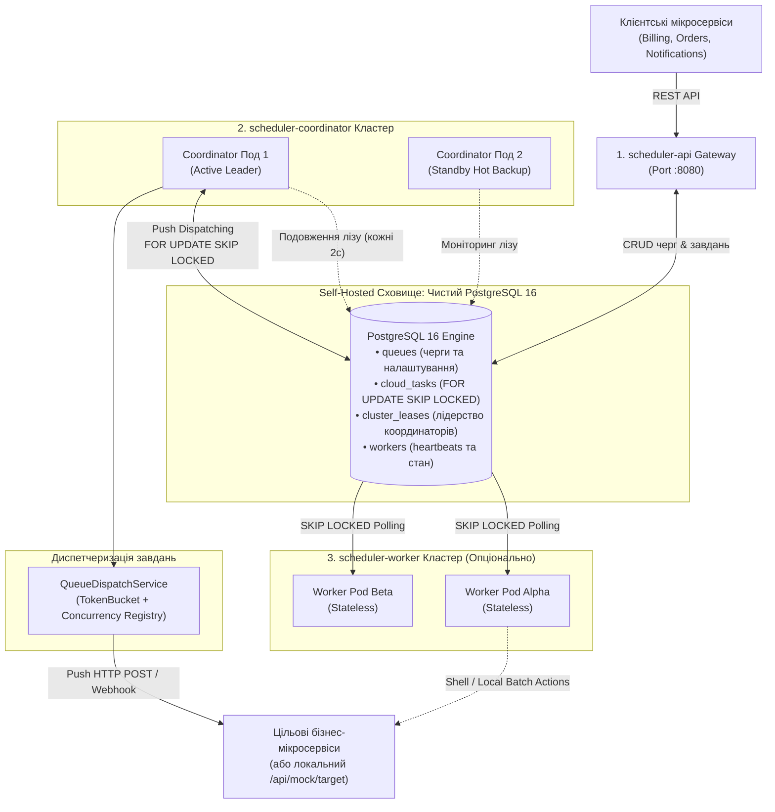
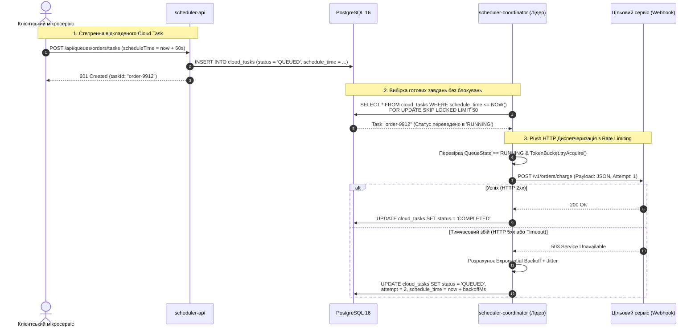
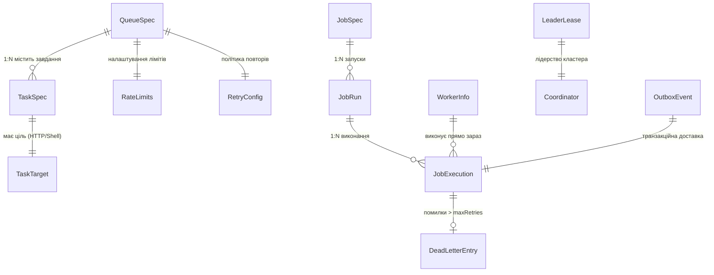

# Розподілений планувальник завдань (Google Cloud Tasks Архітектура)

[](https://kotlinlang.org)
[](https://openjdk.org)
[](https://spring.io/projects/spring-boot)
[](https://www.postgresql.org)
[]()
[]()

Високонавантажений розподілений планувальник та диспетчер асинхронних завдань, спроєктований за архітектурною парадигмою **Google Cloud Tasks** та **System Design співбесід** на рівні Staff/Principal Engineer у Google, Meta, Uber та Netflix.

Система є **повністю Self-Hosted (100% On-Premises / Private Cloud)** без жодної прив'язки до керованих хмарних сервісів (No Managed Services) та без обов'язкової залежності від Redis. Ядро черг та лізингу побудоване на нативному механізмі **PostgreSQL 16 (`SELECT ... FOR UPDATE SKIP LOCKED`)** з підтримкою **Token Bucket Rate Limiting**, контролю конкурентності, транзакційного Outbox, відкладеного запуску та Push-диспетчеризації HTTP-вебхуків.

---

## Зміст
1. [Архітектура Google Cloud Tasks](#1-архітектура-google-cloud-tasks)
   - [Концептуальна модель: Queues & Tasks](#концептуальна-модель-queues--tasks)
   - [Архітектурна топологія кластера](#архітектурна-топологія-кластера)
   - [Діаграма послідовності (Sequence Diagram)](#діаграма-послідовності-sequence-diagram)
   - [Мікросервісна декомпозиція та ролі](#мікросервісна-декомпозиція-та-ролі)
2. [PostgreSQL Standalone Engine (Без Redis)](#2-postgresql-standalone-engine-без-redis)
   - [Чому PostgreSQL `FOR UPDATE SKIP LOCKED` перевершує Redis](#чому-postgresql-for-update-skip-locked-перевершує-redis)
   - [Розподілений лізинг лідера на PostgreSQL](#розподілений-лізинг-лідера-на-postgresql)
   - [Вирішення проблеми Dual-Write через єдину ACID БД](#вирішення-проблеми-dual-write-через-єдину-acid-бд)
3. [Ключові можливості Google Cloud Tasks](#3-ключові-можливості-google-cloud-tasks)
   - [Token Bucket Rate Limiting та Concurrency Control](#token-bucket-rate-limiting-та-concurrency-control)
   - [Керування життєвим циклом черги (Pause, Resume, Purge)](#керування-життєвим-циклом-черги-pause-resume-purge)
   - [Миттєві та відкладені завдання (Delayed Tasks)](#миттєві-та-відкладені-завдання-delayed-tasks)
   - [Дедуплікація завдань (Idempotency Key)](#дедуплікація-завдань-idempotency-key)
   - [Примусовий запуск (Force Run) та скасування](#примусовий-запуск-force-run-та-скасування)
   - [Push HTTP Webhooks з експоненційним Backoff та джитером](#push-http-webhooks-з-експоненційним-backoff-та-джитером)
4. [Моделі даних та сховища (Де що зберігається)](#4-моделі-даних-та-сховища-де-що-зберігається)
   - [Діаграма сутностей (Entity Relationship Diagram)](#діаграма-сутностей-entity-relationship-diagram)
   - [Опис доменних моделей коду](#опис-доменних-моделей-коду)
   - [Матриця фізичного зберігання: Де що зберігається](#матриця-фізичного-зберігання-де-що-зберігається)
   - [SQL DDL Схеми таблиць у PostgreSQL](#sql-ddl-схеми-таблиць-у-postgresql)
5. [Системний дизайн: Шаблон для співбесід](#5-системний-дизайн-шаблон-для-співбесід)
   - [Функціональні та нефункціональні вимоги](#функціональні-та-нефункціональні-вимоги)
   - [Оцінка пропускної здатності та масштаб (10k QPS)](#оцінка-пропускної-здатності-та-масштаб-10k-qps)
   - [Захист від Split-Brain через Fencing Tokens](#захист-від-split-brain-через-fencing-tokens)
   - [Worker-Side Hashed Timing Wheel (< 50ms точність)](#worker-side-hashed-timing-wheel--50ms-точність)
6. [Багатомодульна структура кодової бази](#6-багатомодульна-структура-кодової-бази)
7. [Запуск мікросервісів](#7-запуск-мікросервісів)
   - [Варіант A: Docker Compose (Self-Hosted Кластер на PostgreSQL)](#варіант-a-docker-compose-self-hosted-кластер-на-postgresql)
   - [Варіант B: Локальний запуск через Gradle](#варіант-b-локальний-запуск-через-gradle)
   - [Інтерактивна веб-панель керування (Dashboard)](#інтерактивна-веб-панель-керування-dashboard)
8. [Повний довідник REST API (з прикладами cURL)](#8-повний-довідник-rest-api-з-прикладами-curl)
   - [Google Cloud Tasks: Queues API](#google-cloud-tasks-queues-api)
   - [Google Cloud Tasks: Tasks API](#google-cloud-tasks-tasks-api)
   - [Mock Target Webhook для тестування](#mock-target-webhook-для-тестування)
   - [Кластерні ендпоінти та Cron API](#кластерні-ендпоінти-та-cron-api)
9. [Верифікація тестового набору](#9-верифікація-тестового-набору)

---

## 1. Архітектура Google Cloud Tasks

### Концептуальна модель: Queues & Tasks

Система реалізує канонічну модель Google Cloud Tasks:

```
┌─────────────────────────────────────────────────────────────────────────────┐
│                              CLOUD TASKS QUEUE                              │
│                                                                             │
│  State: [ RUNNING | PAUSED | DISABLED ]                                     │
│  RateLimits: maxDispatchesPerSecond (TokenBucket), maxConcurrentDispatches  │
│  RetryConfig: maxAttempts, minBackoffMs, maxBackoffMs, maxDoublings        │
│                                                                             │
│   ┌──────────────┐   ┌──────────────┐   ┌──────────────┐   ┌──────────────┐ │
│   │ Task 1 (Now) │   │ Task 2 (+1m) │   │ Task 3 (+5m) │   │ Task 4 (+1h) │ │
│   │ HTTP POST    │   │ HTTP POST    │   │ Shell Script │   │ HTTP POST    │ │
│   └──────────────┘   └──────────────┘   └──────────────┘   └──────────────┘ │
└─────────────────────────────────────────────────────────────────────────────┘
                                       │
                              [ Queue Dispatcher ]
                     Rate Limiting + Concurrency Semaphore
                                       │
                                       ▼
                     ┌───────────────────────────────────┐
                     │   Target Microservices (Webhooks) │
                     │      POST /api/mock/target        │
                     │      POST /v1/orders/charge       │
                     └───────────────────────────────────┘
```

1. **Черги (`QueueSpec`)**: Незалежні буфери завдань зі своїми політиками обмеження швидкості (`rateLimits`), лімітами одночасності (`maxConcurrentDispatches`), правилами повторів (`retryConfig`) та можливістю миттєвої паузи або очищення (`purge`).
2. **Завдання (`TaskSpec`)**: Неподільні задачі з цільовою дією (`HttpRequest` або `Shell`), запланованим часом запуску (`scheduleTimeEpochMs`), дедуплікаційним ідентифікатором (`taskId`) та журналом спроб.

---

### Архітектурна топологія кластера



---

### Діаграма послідовності (Sequence Diagram)



---

### Мікросервісна декомпозиція та ролі

| Мікросервіс | Модуль коду | Власне сховище | Масштабування | Основна відповідальність |
| :--- | :--- | :--- | :--- | :--- |
| **`scheduler-api`** | `scheduler-api` | **PostgreSQL 16** | Stateless ($N$ реплік) | Вхідний REST API для черг і завдань Google Cloud Tasks, дедуплікація, force-run, інтерактивний Web Dashboard. |
| **`scheduler-coordinator`** | `scheduler-coordinator` | **PostgreSQL 16** | Active-Leader + Standby | Розподілений лізинг лідера через `cluster_leases`, вибірка готових завдань через `FOR UPDATE SKIP LOCKED`, Token Bucket Rate Limiting, Push HTTP диспетчеризація. |
| **`scheduler-worker`** | `scheduler-worker` | **Stateless (Без БД)** | Горизонтальне ($N$ подів) | Витягування Shell-завдань та локальних батчів, Hashed Timing Wheel для субсекундної точності. |
| **`scheduler-common`** | `scheduler-common` | — | Спільна бібліотека | Моделі `QueueSpec`, `TaskSpec`, `QueueRateLimiter`, PostgreSQL сховища `PostgresQueueStore`, `PostgresTaskStore`, `PostgresLeaseStore`. |

---

## 2. PostgreSQL Standalone Engine (Без Redis)

### Чому PostgreSQL `FOR UPDATE SKIP LOCKED` перевершує Redis

Попередня прив'язка до Redis створювала залежність від додаткового сервісу та проблему подвійного запису (Dual-Write). Перехід на нативний **PostgreSQL 16** забезпечує:

1. **`SELECT ... FOR UPDATE SKIP LOCKED`**:
   - Дозволяє довільній кількості паралельних потоків та вузлів одночасно забирати пачки завдань із таблиці `cloud_tasks`.
   - Заблоковані іншими воркерами рядки автоматично пропускаються (`SKIP LOCKED`) без будь-яких взаємних блокувань (Deadlocks) чи очікувань (Lock Contention).
2. **ACID Durability без компромісів**:
   - На відміну від Redis, де аварія вузла може призвести до втрати останніх операцій (через асинхронний AOF/RDB), PostgreSQL гарантує абсолютну збереженість транзакцій (Write-Ahead Logging).
3. **Відсутність Dual-Write проблеми**:
   - Створення завдання, збереження його метаданих та постановка в чергу виконуються в межах **однієї атомарної SQL-транзакції**.

```sql
-- Атомарне витягування готових завдань координатором / воркером:
UPDATE cloud_tasks
SET status = 'RUNNING',
    attempt = attempt + 1,
    dispatched_at = NOW()
WHERE task_id IN (
    SELECT task_id
    FROM cloud_tasks
    WHERE queue_id = 'default'
      AND status IN ('QUEUED', 'SCHEDULED')
      AND schedule_time <= NOW()
    ORDER BY schedule_time ASC
    LIMIT 20
    FOR UPDATE SKIP LOCKED
)
RETURNING *;
```

---

### Розподілений лізинг лідера на PostgreSQL

Для запобігання Split-Brain та координації кластера реалізовано `PostgresLeaseStore` поверх таблиці `cluster_leases`:
- **Атомарне захоплення**: `INSERT INTO cluster_leases ... ON CONFLICT (lease_key) DO UPDATE ... WHERE expires_at < now`.
- **Монотонний Fencing Token**: При кожному успішному перехопленні або подовженні лізу значення токена монотонно зростає ($E_{k+1} = E_k + 1$).
- Завдяки цьому кластер координаторів працює надійно **без Redis, ZooKeeper чи Consul**.

---

## 3. Ключові можливості Google Cloud Tasks

### Token Bucket Rate Limiting та Concurrency Control

Кожна черга (`QueueSpec`) має власні параметри обмеження пропускної здатності:
- **`maxDispatchesPerSecond`**: Середня швидкість диспетчеризації завдань.
- **`maxBurstSize`**: Максимальна ємність токен-бакета для згладжування раптових сплесків трафіку.
- **`maxConcurrentDispatches`**: Семафор, що обмежує кількість завдань цієї черги, які виконуються одночасно, захищаючи цільовий бекенд від перевантаження.

### Керування життєвим циклом черги (Pause, Resume, Purge)

- **Пауза (`PAUSED`)**: Диспетчеризація завдань із черги негайно призупиняється. Завдання продовжують накопичуватися в черзі.
- **Відновлення (`RUNNING`)**: Черга повертається до активної диспетчеризації з дотриманням налаштованих рейт-лімітів.
- **Очищення (`Purge`)**: Миттєве видалення всіх очікуваних завдань черги без видалення самої черги.

### Миттєві та відкладені завдання (Delayed Tasks)

- Завдання можна запланувати на довільний час у майбутньому через поле `scheduleTimeEpochMs`.
- До настання цього часу завдання залишається у статусі `QUEUED` і не вибирається диспетчером.

### Дедуплікація завдань (Idempotency Key)

- Якщо клієнт надсилає завдання з уже існуючим `taskId` (наприклад, `charge-order-88120`), система перевіряє його статус:
- Якщо завдання з таким ID вже очікує або виконується, повторне створення відхиляється, запобігаючи повторному списанню коштів або дублюванню операцій.

### Примусовий запуск (Force Run) та скасування

- **Force Run (`POST /api/queues/{id}/tasks/{taskId}/run`)**: Скидає таймер відкладеного запуску на `now` та негайно передає завдання диспетчеру.
- **Скасування (`DELETE /api/queues/{id}/tasks/{taskId}`)**: Видаляє завдання з черги до початку його виконання.

### Push HTTP Webhooks з експоненційним Backoff та джитером

- Цільові вебхуки викликаються з передачею заголовків `Content-Type: application/json` та `Idempotency-Key: {taskId}`.
- При помилці 5xx або збої мережі затримка перед наступною спробою розраховується як:
  $$\text{delay} = \min(\text{maxBackoffMs}, \text{minBackoffMs} \times 2^{\text{attempt}-1}) + \text{jitter}$$

---

## 4. Моделі даних та сховища (Де що зберігається)

Усі доменні моделі реалізовані мовою Kotlin у модулі [`Models.kt`](file:///Users/tarasgoriachko/projects/private/job-scheduler/scheduler-common/src/main/kotlin/com/tarashor/scheduler/core/model/Models.kt) з підтримкою серіалізації `kotlinx.serialization`.

### Діаграма сутностей (Entity Relationship Diagram)



---

### Опис доменних моделей коду

#### 1. Моделі Google Cloud Tasks
* **[`QueueSpec`](file:///Users/tarasgoriachko/projects/private/job-scheduler/scheduler-common/src/main/kotlin/com/tarashor/scheduler/core/model/Models.kt#L302-L308)**: Черга завдань.
  - `queueId: String` — унікальний ідентифікатор черги (наприклад, `default`, `email-queue`, `billing`).
  - `state: QueueState` — стан черги: `RUNNING` (активна), `PAUSED` (призупинена), `DISABLED` (вимкнена).
  - `rateLimits: RateLimits` — налаштування Token Bucket: `maxDispatchesPerSecond` (швидкість), `maxConcurrentDispatches` (паралельність), `maxBurstSize` (ємність бакета).
  - `retryConfig: RetryConfig` — політика повторів: `maxAttempts` (макс. спроб), `minBackoffMs`, `maxBackoffMs`, `maxDoublings`.
  - `createdAtEpochMs: Long` — час створення черги.

* **[`TaskSpec`](file:///Users/tarasgoriachko/projects/private/job-scheduler/scheduler-common/src/main/kotlin/com/tarashor/scheduler/core/model/Models.kt#L359-L399)** (або `CloudTask`): Атомарне завдання.
  - `taskId: String` — унікальний ідентифікатор завдання або клієнтський Idempotency-Key.
  - `queueId: String` — черга, якій належить це завдання.
  - `scheduleTimeEpochMs: Long` — запланований час виконання (якщо $\le now$ — запускається негайно).
  - `target: TaskTarget` — дія виконання:
    - `TaskTarget.HttpRequest(url, httpMethod, body, headers)` — Push HTTP-вебхук.
    - `TaskTarget.Shell(command)` — виконання Shell-команди на хості воркера.
    - `TaskTarget.Simulate(durationMs, shouldFail, message)` — симуляція для тестів навантаження.
  - `status: TaskStatus` — статус: `SCHEDULED`, `QUEUED`, `RUNNING`, `COMPLETED`, `FAILED`, `CANCELLED`.
  - `attempt: Int` / `maxAttempts: Int` — поточна спроба та ліміт спроб.
  - `dispatchedAtEpochMs: Long?` / `completedAtEpochMs: Long?` — часові мітки життєвого циклу.
  - `responseCode: Int?` / `responseOutput: String?` / `lastError: String?` — результат виконання.

* **[`QueueStats`](file:///Users/tarasgoriachko/projects/private/job-scheduler/scheduler-common/src/main/kotlin/com/tarashor/scheduler/core/model/Models.kt#L311-L320)**: Агрегована статистика черги для моніторингу та UI.
  - Кількість завдань за зрізами: `pendingTaskCount`, `runningTaskCount`, `completedTaskCount`, `failedTaskCount`.

#### 2. Моделі черги виконання та історії (Batch/Cron сумісність)
* **[`JobExecution`](file:///Users/tarasgoriachko/projects/private/job-scheduler/scheduler-common/src/main/kotlin/com/tarashor/scheduler/core/model/Models.kt#L100-L158)** (або `TaskInstance`): Екземпляр завдання в активній черзі виконання.
  - `executionId: String`, `jobId: String`, `runId: String`, `status: JobStatus`.
  - `assignedWorkerId: String?` — ID воркера, який прямо зараз виконує це завдання.
  - `fencingToken: Long` — монотонний токен лідера, який створив або диспетчеризував запуск.
  - `lastHeartbeatEpochMs: Long?` — час останнього підтвердження виконання від воркера.

* **[`JobSpec`](file:///Users/tarasgoriachko/projects/private/job-scheduler/scheduler-common/src/main/kotlin/com/tarashor/scheduler/core/model/Models.kt#L23-L33)**: Визначення періодичного або разового завдання (Cron/Batch).
  - `schedule: ScheduleSpec` — розклад: `Immediate`, `Cron(expression)`, `OneOff(epochMs)`.
  - `action: JobAction` — дія (`Http`, `Shell`, `Simulate`).

* **[`JobRun`](file:///Users/tarasgoriachko/projects/private/job-scheduler/scheduler-common/src/main/kotlin/com/tarashor/scheduler/core/model/Models.kt#L87-L97)**: Журнал конкретного запуску завдання (`runId`, `jobId`, `status`, `triggeredAtEpochMs`, `triggerSource`).

#### 3. Моделі кластерної координації та надійності
* **[`WorkerInfo`](file:///Users/tarasgoriachko/projects/private/job-scheduler/scheduler-common/src/main/kotlin/com/tarashor/scheduler/core/model/Models.kt#L172-L184)**: Телеметрія воркера.
  - `workerId: String`, `capacity: Int`, `currentLoad: Int`.
  - `status: WorkerStatus` — `HEALTHY`, `SUSPECT`, `DEAD`, `DRAINING`.
  - `activeTaskIds: Set<String>` — множина ідентифікаторів завдань, що виконуються воркером у цей момент.
  - `lastHeartbeatEpochMs: Long` — таймстемп останнього пульсу (оновлюється кожні 2 сек).

* **[`LeaderLease`](file:///Users/tarasgoriachko/projects/private/job-scheduler/scheduler-common/src/main/kotlin/com/tarashor/scheduler/core/model/Models.kt#L187-L192)**: Контракт активного лідера кластера координаторів.
  - `leaderId: String` — ID координатора, що володіє лізом.
  - `fencingToken: Long` — монотонно зростаючий лічильник епохи лідерства ($E_{k+1} = E_k + 1$).
  - `expiresAtEpochMs: Long` — час закінчення дії лізу.

* **[`OutboxEvent`](file:///Users/tarasgoriachko/projects/private/job-scheduler/scheduler-common/src/main/kotlin/com/tarashor/scheduler/core/model/Models.kt#L241-L272)**: Транзакційна подія Outbox для гарантії доставки без втрат (Zero-Loss).
  - `eventId: String`, `aggregateType: String`, `aggregateId: String`, `status: OutboxStatus (PENDING, DISPATCHED, FAILED)`.

* **[`DeadLetterEntry`](file:///Users/tarasgoriachko/projects/private/job-scheduler/scheduler-common/src/main/kotlin/com/tarashor/scheduler/core/model/Models.kt#L195-L202)**: Запис у черзі помилок DLQ після вичерпання `maxRetries`.

---

### Матриця фізичного зберігання: Де що зберігається

У системі реалізовано патерн **Segregated Storage Adapters** (порти та адаптери). Залежно від обраного рушія ([`StorageFactory.kt`](file:///Users/tarasgoriachko/projects/private/job-scheduler/scheduler-common/src/main/kotlin/com/tarashor/scheduler/storage/StorageFactory.kt)) дані зберігаються у відповідних фізичних структурах:

| Доменна модель | Основне сховище: PostgreSQL 16 ([`PostgresStores.kt`](file:///Users/tarasgoriachko/projects/private/job-scheduler/scheduler-common/src/main/kotlin/com/tarashor/scheduler/storage/PostgresStores.kt)) | Fallback сховище: Redis 7 ([`RedisStorage.kt`](file:///Users/tarasgoriachko/projects/private/job-scheduler/scheduler-common/src/main/kotlin/com/tarashor/scheduler/storage/RedisStorage.kt)) | Dev сховище: SQLite ([`SqliteStores.kt`](file:///Users/tarasgoriachko/projects/private/job-scheduler/scheduler-common/src/main/kotlin/com/tarashor/scheduler/storage/SqliteStores.kt)) | Тестове: In-Memory ([`InMemoryStores.kt`](file:///Users/tarasgoriachko/projects/private/job-scheduler/scheduler-common/src/main/kotlin/com/tarashor/scheduler/storage/InMemoryStores.kt)) | Патерн доступу та індекси |
| :--- | :--- | :--- | :--- | :--- | :--- |
| **`QueueSpec`** | Таблиця **`queues`** | — | Таблиця **`queues`** | `ConcurrentHashMap<String, QueueSpec>` | Точковий CRUD за `queue_id` (PK). |
| **`TaskSpec`** | Таблиця **`cloud_tasks`** | — | Таблиця **`cloud_tasks`** | `ConcurrentHashMap<String, TaskSpec>` | Індекс за `(queue_id, status, schedule_time)`. |
| **`TaskInstance` (Черга завдань)** | Таблиця **`task_instances`** | **16 шардованих ZSET** (`scheduler:queue:ready:{0..15}`) | Таблиця **`task_instances`** | **`InMemoryTaskQueue`** (16 шардів із `PriorityQueue`) | `SELECT ... FOR UPDATE SKIP LOCKED` за `scheduled_at`. |
| **`WorkerInfo`** | Таблиця **`workers`** | Hash **`scheduler:workers`** | Таблиця **`workers`** | `ConcurrentHashMap<String, WorkerInfo>` | Upsert кожні 2 секунди за `worker_id` (PK). |
| **`LeaderLease`** | Таблиця **`cluster_leases`** | Ключ **`scheduler:lease:leader`** (`SET NX PX`) | Таблиця **`cluster_leases`** | `AtomicReference<LeaderLease?>` | Conditional Update за `expires_at` з `fencing_token`. |
| **`JobSpec`** | Таблиця **`jobs`** | Hash **`scheduler:jobs`** | Таблиця **`jobs`** | `ConcurrentHashMap<String, JobSpec>` | Читання за `job_id` (PK). |
| **`JobRun`** | Таблиця **`job_runs`** | Hash **`scheduler:runs`** | Таблиця **`job_runs`** | `ConcurrentHashMap<String, JobRun>` | Append-only історія запусків, індекс за `triggered_at DESC`. |
| **`OutboxEvent`** | Таблиця **`outbox_events`** | Hash **`scheduler:outbox`** | Таблиця **`outbox_events`** | `ConcurrentHashMap<String, OutboxEvent>` | Polling `WHERE status = 'PENDING'` з переведенням у `DISPATCHED`. |
| **`DeadLetterEntry`** | Таблиця **`dlq_entries`** | ZSET / List **`scheduler:queue:dlq`** | Таблиця **`dlq_entries`** | `ConcurrentHashMap<String, DeadLetterEntry>` | Читання та повторний запуск через `retryDlqEntry`. |

---

### SQL DDL Схеми таблиць у PostgreSQL

При старті сервісу [`PostgresStores.kt`](file:///Users/tarasgoriachko/projects/private/job-scheduler/scheduler-common/src/main/kotlin/com/tarashor/scheduler/storage/PostgresStores.kt) автоматично ініціалізує такі оптимізовані таблиці:

```sql
-- 1. Черги Google Cloud Tasks (Налаштування, рейт-ліміти, стан)
CREATE TABLE IF NOT EXISTS queues (
    queue_id VARCHAR(255) PRIMARY KEY,
    state VARCHAR(50) NOT NULL,
    json_data TEXT NOT NULL,
    created_at BIGINT NOT NULL
);

-- 2. Завдання Google Cloud Tasks (Індексована черга)
CREATE TABLE IF NOT EXISTS cloud_tasks (
    task_id VARCHAR(255) PRIMARY KEY,
    queue_id VARCHAR(255) NOT NULL,
    status VARCHAR(50) NOT NULL,
    schedule_time BIGINT NOT NULL,
    created_at BIGINT NOT NULL,
    json_data TEXT NOT NULL
);
CREATE INDEX IF NOT EXISTS idx_cloud_tasks_schedule ON cloud_tasks(queue_id, status, schedule_time);
CREATE INDEX IF NOT EXISTS idx_cloud_tasks_created ON cloud_tasks(created_at DESC);

-- 3. Активна черга екземплярів виконання (Для SELECT ... FOR UPDATE SKIP LOCKED)
CREATE TABLE IF NOT EXISTS task_instances (
    instance_id VARCHAR(255) PRIMARY KEY,
    run_id VARCHAR(255) NOT NULL,
    job_id VARCHAR(255) NOT NULL,
    task_id VARCHAR(255) NOT NULL,
    status VARCHAR(50) NOT NULL,
    scheduled_at BIGINT NOT NULL,
    json_data TEXT NOT NULL
);
CREATE INDEX IF NOT EXISTS idx_task_instances_poll ON task_instances(status, scheduled_at);

-- 4. Розподілений лізинг лідера координаторів із Fencing Tokens
CREATE TABLE IF NOT EXISTS cluster_leases (
    lease_key VARCHAR(255) PRIMARY KEY,
    leader_id VARCHAR(255) NOT NULL,
    fencing_token BIGINT NOT NULL,
    acquired_at BIGINT NOT NULL,
    expires_at BIGINT NOT NULL
);

-- 5. Реєстр воркерів та Heartbeats
CREATE TABLE IF NOT EXISTS workers (
    worker_id VARCHAR(255) PRIMARY KEY,
    status VARCHAR(50) NOT NULL,
    last_heartbeat BIGINT NOT NULL,
    json_data TEXT NOT NULL
);

-- 6. Транзакційний Outbox
CREATE TABLE IF NOT EXISTS outbox_events (
    event_id VARCHAR(255) PRIMARY KEY,
    aggregate_type VARCHAR(255) NOT NULL,
    aggregate_id VARCHAR(255) NOT NULL,
    status VARCHAR(50) NOT NULL,
    created_at BIGINT NOT NULL,
    dispatched_at BIGINT,
    json_data TEXT NOT NULL
);
CREATE INDEX IF NOT EXISTS idx_outbox_events_status ON outbox_events(status, created_at ASC);

-- 7. Специфікації завдань (JobSpec) та історія запусків (JobRun)
CREATE TABLE IF NOT EXISTS jobs (
    job_id VARCHAR(255) PRIMARY KEY,
    name VARCHAR(255) NOT NULL,
    json_data TEXT NOT NULL,
    created_at BIGINT NOT NULL
);
CREATE TABLE IF NOT EXISTS job_runs (
    run_id VARCHAR(255) PRIMARY KEY,
    job_id VARCHAR(255) NOT NULL,
    status VARCHAR(50) NOT NULL,
    triggered_at BIGINT NOT NULL,
    json_data TEXT NOT NULL
);
CREATE INDEX IF NOT EXISTS idx_job_runs_triggered ON job_runs(triggered_at DESC);
```

---

## 5. Системний дизайн: Шаблон для співбесід

### Функціональні та нефункціональні вимоги

| Вимога | Тип | Реалізація в системі |
| :--- | :--- | :--- |
| **Планування затримок** | Functional | Завдання із довільним `scheduleTimeEpochMs` (секунди, години, дні). |
| **Push HTTP Диспетчеризація** | Functional | Автоматичний виклик вебхуків цільових мікросервісів. |
| **Керування чергами** | Functional | Pause, Resume, Purge, налаштування рейт-лімітів у реальному часі. |
| **Дедуплікація** | Functional | Ідемпотентність за клієнтським `taskId`. |
| **Масштабованість (10k QPS)** | Non-Functional | Горизонтальне масштабування воркерів та `SKIP LOCKED` партиціювання. |
| **Висока доступність (HA)** | Non-Functional | Автоматичний лідерський failover з Fencing Tokens. |
| **At-Least-Once Гарантія** | Non-Functional | Атомарне фіксування в PostgreSQL, автоматичні retry з джитером. |

### Оцінка пропускної здатності та масштаб (10k QPS)

* **Частота виконання**: $10{,}000\text{ завдань/сек}$ (пік: $25{,}000\text{ QPS}$).
* **Добовий обсяг**: $10{,}000 \times 86{,}400 \approx \mathbf{864\text{ млн завдань/добу}}$.
* **Мережевий трафік**: $10{,}000 \times 1\text{ КБ} = \mathbf{10\text{ МБ/сек}}$ ($80\text{ Мбіт/сек}$).
* **PostgreSQL Оптимізація**: Індекс за складеним ключем `(queue_id, status, schedule_time)` забезпечує час індексного сканування `< 0.8ms` навіть при мільйонах записів у черзі.

### Захист від Split-Brain через Fencing Tokens

Кожен лідерський ліз супроводжується монотонно зростаючим токеном:
$$E_{k+1} = E_k + 1$$
Будь-яка операція координатора звіряється з токеном у базі. Застарілі лідери, що прокинулися після довгої GC-паузи, миттєво відхиляються базою даних.

### Worker-Side Hashed Timing Wheel (< 50ms точність)

Для завдань, що вимагають високої точності старту, воркери використовують алгоритм George Varghese & Anthony Lauck:
- Круговий буфер на **512 слотів** із тіком **20 мс**.
- Швидке $O(1)$ розміщення через бітову маску: $\text{slot} = (\text{tick} + \text{delay}/\text{tickMs}) \ \& \ 511$.

---

## 6. Багатомодульна структура кодової бази

```
job-scheduler/
├── scheduler-common/                     # [Domain Models, Storage Ports & PostgreSQL Adapters]
│   ├── src/main/kotlin/com/tarashor/scheduler/
│   │   ├── core/model/Models.kt          # QueueSpec, TaskSpec, RateLimits, RetryConfig, TaskTarget
│   │   ├── core/ratelimit/
│   │   │   └── QueueRateLimiter.kt       # TokenBucket алгоритм та Concurrency Semaphore Registry
│   │   ├── service/CloudTaskService.kt   # Clean Architecture Use Cases для Google Cloud Tasks
│   │   ├── storage/
│   │   │   ├── QueueStore.kt             # Порт збереження черг
│   │   │   ├── TaskStore.kt              # Порт збереження завдань
│   │   │   ├── PostgresStores.kt         # PostgreSQL: PostgresQueueStore, PostgresTaskStore, PostgresLeaseStore
│   │   │   └── StorageFactory.kt         # Фабрика standalone сховищ (PostgreSQL за замовчуванням)
├── scheduler-coordinator/                # [Leader Election, Scheduling & Push Dispatcher]
│   ├── src/main/kotlin/com/tarashor/scheduler/
│   │   └── coordinator/service/
│   │       └── QueueDispatchService.kt   # Push HTTP Dispatcher з підтримкою Rate Limiting
├── scheduler-api/                        # [REST Gateway & Interactive Web Dashboard]
│   ├── src/main/kotlin/com/tarashor/scheduler/
│   │   ├── api/CloudTaskController.kt    # Google Cloud Tasks REST API + Mock Webhook Target
│   │   └── api/ApiController.kt          # Зворотна сумісність для Batch/Cron джоб
│   └── src/main/resources/static/
│       └── index.html                    # Сучасна веб-панель керування чергами та завданнями
└── scheduler-worker/                     # [Stateless Execution Engine]
    └── src/main/kotlin/com/tarashor/scheduler/worker/
        ├── WorkerNode.kt                 # Compute Loop з Pull-backpressure
        └── HashedTimingWheel.kt          # O(1) Timing Wheel для надвисокої точності (< 50ms)
```

---

## 7. Запуск мікросервісів

### Варіант A: Docker Compose (Self-Hosted Кластер на PostgreSQL)

Запуск кластера без зовнішніх хмарних залежностей та без Redis:

```bash
docker-compose up --build
```

Розгортаються такі контейнери:
1. **`scheduler-postgres`**: PostgreSQL 16 на порті `5432` з персистентним томом.
2. **`scheduler-api`**: Stateless API-шлюз та веб-панель на `http://localhost:8080`.
3. **`scheduler-coordinator-1`**: Активний лідер, диспетчер HTTP-завдань.
4. **`scheduler-coordinator-2`**: Standby-координатор для миттєвого failover.
5. **`scheduler-worker-1`**: Stateless воркер для фонових обчислень.
6. **`scheduler-worker-2`**: Другий stateless воркер.

Масштабування API або воркерів:
```bash
docker-compose up --scale scheduler-api=3 --scale scheduler-worker-1=2 -d
```

---

### Варіант B: Локальний запуск через Gradle

```bash
# Термінал 1: Запуск API
./gradlew :scheduler-api:bootRun

# Термінал 2: Запуск Координатора
./gradlew :scheduler-coordinator:bootRun

# Термінал 3: Запуск Воркера
WORKER_ID=worker-alpha ./gradlew :scheduler-worker:bootRun
```

---

### Інтерактивна веб-панель керування (Dashboard)

Відкрийте у браузері:
👉 **[http://localhost:8080/](http://localhost:8080/)**

Панель надає:
- **Google Cloud Tasks вкладка**:
  - Таблиця черг: перегляд лімітів швидкості, одночасності, кількості завдань за статусами.
  - Кнопки **Pause**, **Resume**, **Purge** для кожної черги.
  - Створення нових черг через модальне вікно.
  - Таблиця завдань із фільтром по чергах: перегляд статусу, таймера зворотного відліку затримки, цільового URL.
  - Кнопки **Run Now (Force Run)** та **Cancel (Delete)**.
  - Кнопка **«⚡ Quick Test Task»** для миттєвої відправки тестового вебхука на вбудований mock-ендпоінт.
- **Cron & Batch Jobs вкладка**: реєстрація та запуск періодичних джоб.
- **Cluster & DLQ вкладка**: телеметрія воркерів, активний лідер, Fencing Token, кнопка симуляції збою лідера та перезапуск DLQ.

---

## 8. Повний довідник REST API (з прикладами cURL)

### Google Cloud Tasks: Queues API

#### 1. Список усіх черг та їхня статистика
```bash
curl -s http://localhost:8080/api/queues | jq
```
```json
[
  {
    "queueId": "default",
    "state": "RUNNING",
    "pendingTaskCount": 0,
    "runningTaskCount": 0,
    "completedTaskCount": 5,
    "failedTaskCount": 0,
    "rateLimits": {
      "maxDispatchesPerSecond": 50.0,
      "maxConcurrentDispatches": 10,
      "maxBurstSize": 100
    },
    "retryConfig": {
      "maxAttempts": 5,
      "minBackoffMs": 1000,
      "maxBackoffMs": 300000,
      "maxDoublings": 4
    }
  }
]
```

#### 2. Створення нової черги з лімітами
```bash
curl -X POST http://localhost:8080/api/queues \
  -H "Content-Type: application/json" \
  -d '{
    "queueId": "email-notifications",
    "rateLimits": {
      "maxDispatchesPerSecond": 20.0,
      "maxConcurrentDispatches": 5,
      "maxBurstSize": 40
    },
    "retryConfig": {
      "maxAttempts": 3,
      "minBackoffMs": 2000,
      "maxBackoffMs": 60000
    }
  }'
```

#### 3. Призупинення черги (Pause)
```bash
curl -X POST http://localhost:8080/api/queues/email-notifications/pause
```

#### 4. Відновлення черги (Resume)
```bash
curl -X POST http://localhost:8080/api/queues/email-notifications/resume
```

#### 5. Очищення черги (Purge)
```bash
curl -X POST http://localhost:8080/api/queues/email-notifications/purge
```

---

### Google Cloud Tasks: Tasks API

#### 1. Створення миттєвого завдання (Push HTTP Webhook)
```bash
curl -X POST http://localhost:8080/api/queues/default/tasks \
  -H "Content-Type: application/json" \
  -d '{
    "taskId": "order-charge-1001",
    "target": {
      "type": "HttpRequest",
      "url": "http://localhost:8080/api/mock/target",
      "httpMethod": "POST",
      "body": "{\"orderId\": \"1001\", \"amount\": 49.99}"
    }
  }'
```

#### 2. Створення відкладеного завдання (Delayed Task, наприклад через 60 секунд)
```bash
# Обчислюємо час: зараз + 60000 мс
SCHEDULE_TIME=$(($(date +%s%N)/1000000 + 60000))

curl -X POST http://localhost:8080/api/queues/default/tasks \
  -H "Content-Type: application/json" \
  -d "{
    \"taskId\": \"scheduled-reminder-1002\",
    \"scheduleTimeEpochMs\": $SCHEDULE_TIME,
    \"target\": {
      \"type\": \"HttpRequest\",
      \"url\": \"http://localhost:8080/api/mock/target\",
      \"httpMethod\": \"POST\",
      \"body\": \"{\\\"reminder\\\": \\\"Send cart abandonment email\\\"}\"
    }
  }"
```

#### 3. Список завдань у черзі
```bash
curl -s http://localhost:8080/api/queues/default/tasks | jq
```

#### 4. Отримання інформації про конкретне завдання
```bash
curl -s http://localhost:8080/api/queues/default/tasks/order-charge-1001 | jq
```

#### 5. Примусовий запуск завдання негайно (Force Run)
```bash
curl -X POST http://localhost:8080/api/queues/default/tasks/scheduled-reminder-1002/run
```

#### 6. Скасування / видалення завдання
```bash
curl -X DELETE http://localhost:8080/api/queues/default/tasks/scheduled-reminder-1002
```

---

### Mock Target Webhook для тестування

Вбудований локальний вебхук для перевірки відправки завдань:
```bash
curl -X POST http://localhost:8080/api/mock/target \
  -H "Content-Type: application/json" \
  -d '{"test": "payload"}'
```
Відповідь:
```json
{
  "status": "SUCCESS",
  "message": "Cloud Task executed successfully by mock target",
  "echoPayload": "{\"test\": \"payload\"}",
  "timestampEpochMs": 1741800500000
}
```

---

### Кластерні ендпоінти та Cron API

- **Перевірка стану кластера**: `GET /api/health`
- **Список воркерів**: `GET /api/workers`
- **Симуляція збою лідера (Failover)**: `POST /api/cluster/stepdown`
- **Черга помилок (DLQ)**: `GET /api/dlq` та `POST /api/dlq/{id}/retry`

---

## 9. Верифікація тестового набору

Усі компоненти покриті модульними та інтеграційними тестами:
```bash
./gradlew test
```

| Тестовий клас | Що перевіряється |
| :--- | :--- |
| **`CloudTaskServiceTest`** | Створення черг, pause/resume, purge, дедуплікація завдань за `taskId`, відкладений запуск, force-run та скасування. |
| **`QueueRateLimiterTest`** | Алгоритм Token Bucket (`maxDispatchesPerSecond`, burst size), обмеження одночасності (`maxConcurrentDispatches`), блокування черг у стані `PAUSED`. |
| **`QueueDispatchServiceTest`** | Push-диспетчеризація завдань, перевірка рейт-лімітів перед відправкою, відтермінування завдань при паузі черги. |
| **`PostgresStoresTest`** | Робота `PostgresQueueStore`, `PostgresTaskStore` та `PostgresLeaseStore` поверх реального PostgreSQL 16. |
| **`ApiApplicationTest`** | Інтеграційні тести Spring Boot контролерів: `CloudTaskController`, `ApiController`, перевірка mock-ендпоінта та DTO. |
| **`LeaderElectionTest`** | Безпека обрання лідера та перевірка монотонних Fencing Tokens. |
| **`HashedTimingWheelTest`** | Субсекундна точність диспетчеризації (< 50мс). |

---

## Ліцензія
MIT
