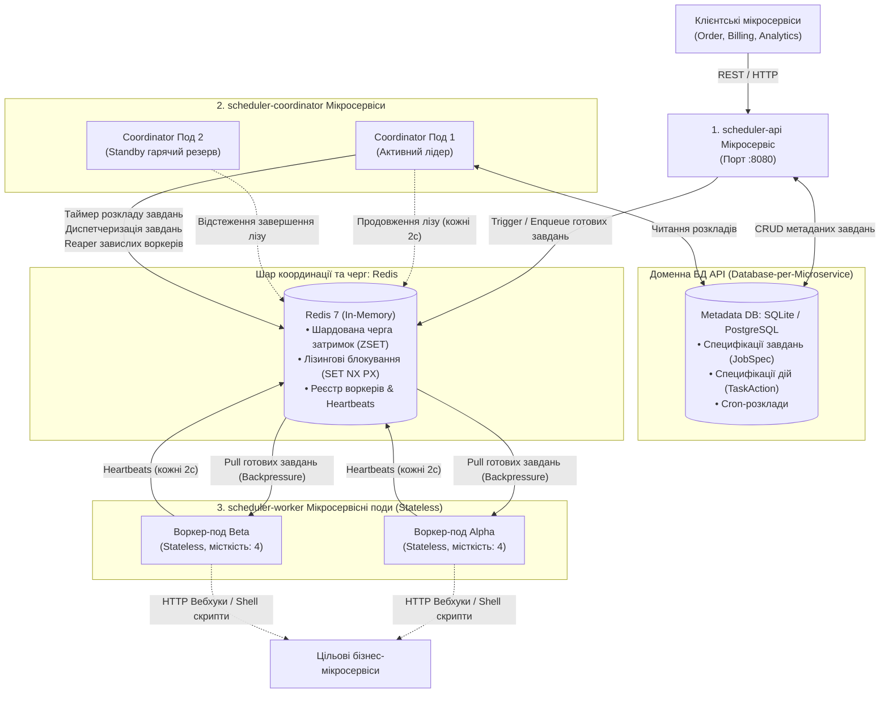
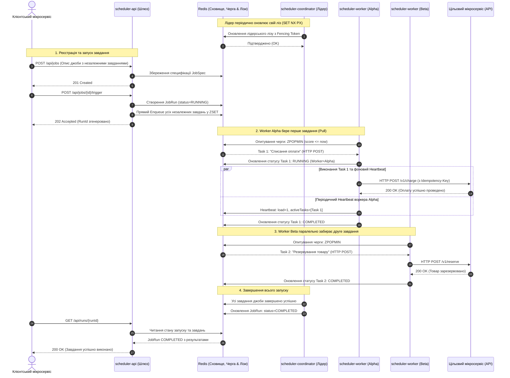
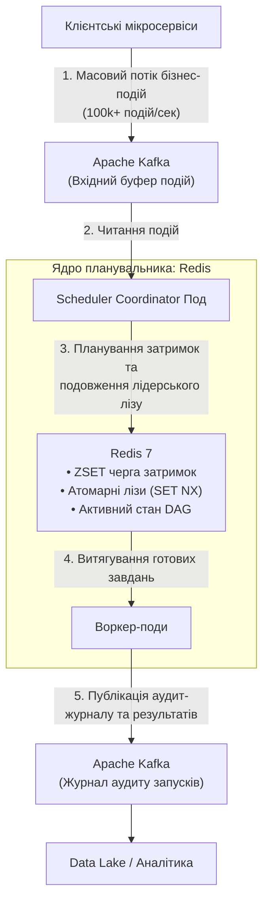

# Розподілений планувальник завдань (Мікросервісна архітектура)

[](https://kotlinlang.org)
[](https://openjdk.org)
[](https://spring.io/projects/spring-boot)
[]()
[]()

Розподілений планувальник завдань, декомпонований на **незалежні контейнеризовані мікросервіси** та спроєктований за канонічним питанням із **System Design співбесід** (*«Design a Distributed Job Scheduler like Quartz, Temporal, or Celery»*), які проводять у Google, Meta, Uber, Amazon та Netflix.

---

## Зміст
1. [Мікросервісна декомпозиція](#1-мікросервісна-декомпозиція)
   - [Архітектурна топологія](#архітектурна-топологія)
   - [Діаграма послідовності (Sequence Diagram)](#діаграма-послідовності-sequence-diagram)
   - [Ролі та обов'язки мікросервісів](#ролі-та-обов-язки-мікросервісів)
2. [Системний дизайн: Шаблон для співбесід](#2-системний-дизайн-шаблон-для-співбесід)
   - [Функціональні та нефункціональні вимоги](#функціональні-та-нефункціональні-вимоги)
   - [Оцінка пропускної здатності та масштаб](#оцінка-пропускної-здатності-та-масштаб)
3. [Поглиблені теми для системного дизайну](#3-поглиблені-теми-для-системного-дизайну)
   - [Доставка «щонайменше один раз» (At-Least-Once) та міжсервісна ідемпотентність](#доставка-щонайменше-один-раз-at-least-once-та-міжсервісна-ідемпотентність)
   - [Захист від Split-Brain через монотонні токени розмежування (Fencing Tokens)](#захист-від-split-brain-через-монотонні-токени-розмежування-fencing-tokens)
   - [Високоточне відкладене планування (Дворівнева бакетизація часу)](#високоточне-відкладене-планування-дворівнева-бакетизація-часу)
   - [Модель диспетчеризації: Push проти Pull та Backpressure](#модель-диспетчеризації-push-проти-pull-та-backpressure)
   - [Атомарне виконання завдань (Atomic Job Execution)](#атомарне-виконання-завдань-atomic-job-execution)
   - [Моніторинг воркерів, Heartbeats та рекламація завдань](#моніторинг-воркерів-heartbeats-та-рекламація-завдань)
   - [Експоненційне відтермінування з джитером (Exponential Backoff with Jitter) та черга DLQ](#експоненційне-відтермінування-з-джитером-exponential-backoff-with-jitter-та-черга-dlq)
   - [Детальне архітектурне обґрунтування: Чому обрано Redis замість Kafka](#детальне-архітектурне-обґрунтування-чому-обрано-redis-замість-kafka)
   - [Канонічна архітектура «Database-per-Microservice» для High-Load (10k QPS)](#канонічна-архітектура-database-per-microservice-для-high-load-10k-qps)
   - [Шардована відкладена черга (16 Shards) для ліквідації ботлнеку Redis](#шардована-відкладена-черга-16-shards-для-ліквідації-ботлнеку-redis)
   - [Worker-Side Hashed Timing Wheel для надвисокої точності виконання (< 50ms)](#worker-side-hashed-timing-wheel-для-надвисокої-точності-виконання--50ms)
   - [Гарантія At-Least-Once через Transactional Outbox Pattern](#гарантія-at-least-once-через-transactional-outbox-pattern)
4. [Багатомодульна структура кодової бази](#4-багатомодульна-структура-кодової-бази)
5. [Запуск мікросервісів](#5-запуск-мікросервісів)
   - [Варіант A: Docker Compose (Повний розподілений кластер)](#варіант-a-docker-compose-повний-розподілений-кластер)
   - [Варіант B: Локальні Gradle-сервіси (Режим розробки)](#варіант-b-локальні-gradle-сервіси-режим-розробки)
   - [Інтерактивна веб-панель керування (Dashboard)](#інтерактивна-веб-панель-керування-dashboard)
   - [Приклади REST API для клієнтських мікросервісів](#приклади-rest-api-для-клієнтських-мікросервісів)
6. [Верифікація тестового набору](#6-верифікація-тестового-набору)

---

## 1. Мікросервісна декомпозиція

Замість монолітної структури система розділена на спеціалізовані, незалежно розгортані мікросервісні субпроєкти:

### Архітектурна топологія



---

### Діаграма послідовності (Sequence Diagram)

Діаграма демонструє наскрізний життєвий цикл: від реєстрації мульти-завдання клієнтським мікросервісом до лідерської координації, паралельного виконання воркерами через HTTP-вебхуки та оновлення статусу запуску.



---

### Ролі та обов'язки мікросервісів

| Мікросервіс | Модуль коду | Власна база даних | Стратегія масштабування | Основна відповідальність |
| :--- | :--- | :--- | :--- | :--- |
| **`scheduler-api`** | `scheduler-api` | **`JobMetadataStore`** (PostgreSQL / SQLite) | Stateless ($N$ реплік за Ingress) | Вхідний REST API, збереження специфікацій завдань, запит статусу запусків, вбудований Web Dashboard. |
| **`scheduler-coordinator`** | `scheduler-coordinator` | **`TaskQueue` + `LeaseStore`** (Redis Cluster) | Active-Active / Standby | Годинник розкладу, лідерський ліз (`LeaderElector`), Transactional Outbox диспетчеризація, Reaper завислих воркерів. |
| **`scheduler-worker`** | `scheduler-worker` | **Stateless (БЕЗ БД)** | Горизонтальне HPA ($N$ подів) | Повністю без збереження стану. Витягує завдання з черги, виконує HTTP-вебхуки/скрипти, надсилає heartbeats у `WorkerRegistry`. |
| **`scheduler-common`** | `scheduler-common` | — | Спільна бібліотека | Чисті доменні моделі, порти сховищ (`JobMetadataStore`, `RunHistoryStore`, `WorkerRegistry`, `OutboxStore`), черги `TaskQueue`, адаптери SQLite, PostgreSQL, Redis. |

---

## 2. Системний дизайн: Шаблон для співбесід

### Функціональні та нефункціональні вимоги

#### Функціональні вимоги (Core Functional Requirements)
1. **Гнучке планування за часом**:
   - **Миттєвий запуск (Immediate)**: Запуск завдання одразу після отримання запиту.
   - **Одноразові відкладені завдання (Future Date / One-off)**: Виконання у визначений момент у майбутньому (наприклад, через 2 години або 15 вересня о 14:00).
2. **Атомарне виконання завдань (Atomic Job Execution)**:
   - Кожне завдання (`JobSpec`) є неподільною атомарною одиницею виконання (1 Job = 1 executable action, наприклад Shell-скрипт або HTTP-вебхук) без потреби в оверхеді графів залежностей (DAG) чи бар'єрних агрегаціях.
3. **Моніторинг статусу (Status Monitoring)**:
   - Можливість перевіряти статус завдань та запусків у реальному часі (`QUEUED`, `RUNNING`, `COMPLETED`, `FAILED`, `DEAD_LETTER`).

#### Нефункціональні вимоги (Core Non-Functional Requirements)
1. **Масштабованість до 10,000 завдань/сек (Scalability up to 10k QPS)**:
   - Система повинна стабільно обробляти та виконувати **$10{,}000$ завдань щосекунди** (з піками до $20{,}000 - 30{,}000$ QPS).
2. **Висока доступність (High Availability: Availability > Consistency)**:
   - За теоремою CAP система обирає **AP (Availability + Partition Tolerance)**.
   - Відмова окремих вузлів, мережеві затримки або реплікаційні лаги не повинні блокувати прийом завдань API чи виконання решти черги.
3. **Жорсткий SLA виконання (Execution SLA $\le 2\text{s}$)**:
   - Завдання повинні запускатися **не пізніше ніж через 2 секунди** від їхнього запланованого часу.
4. **Гарантія виконання «щонайменше один раз» (At-Least-Once Execution)**:
   - Жодне завдання не може бути втрачене. У разі аварії воркера завдання автоматично рекламується і перезапускається. Клієнти використовують `Idempotency-Key` для запобігання дублюванню бізнес-ефектів.

---

### Оцінка пропускної здатності та масштаб (Capacity Estimation: 10k QPS)

* **Частота виконання (Execution Throughput)**:
  $$10{,}000\text{ завдань/сек} \ (\text{пік: } 20{,}000 - 30{,}000\text{ QPS})$$
* **Добовий обсяг (Daily Volume)**:
  $$10{,}000 \times 86{,}400 \approx \mathbf{864\text{ мільйони завдань/добу}} \ (\sim 1\text{ млрд/день})$$
* **Вхідна/вихідна мережа (Network I/O)**:
  При середньому розмірі payload $1\text{ КБ}$:
  $$10{,}000 \times 1\text{ КБ} = \mathbf{10\text{ МБ/сек}} \ (80\text{ Мбіт/сек})$$
* **Зберігання історії за 30 днів (Storage for 30 Days)**:
  $$864\text{ млн} \times 1\text{ КБ} = 864\text{ ГБ/добу} \implies 864\text{ ГБ} \times 30 \approx \mathbf{26\text{ ТБ}}$$
  *(Зберігається в розподіленій базі даних ScyllaDB/Cassandra з вивантаженням холодних даних у Data Lake/S3).*
* **Гарячий буфер черги в пам'яті (RAM for 10-Minute Window in Redis)**:
  Якщо буферизувати в Redis завдання на найближчі 10 хвилин:
  $$10{,}000\text{ jobs/sec} \times 600\text{ sec} \times 1\text{ КБ} \approx \mathbf{6\text{ ГБ RAM}}$$
* **Шардування для забезпечення SLA $\le 2\text{s}$**:
  Розподіл на **64 віртуальні шарди** (`hash(job_id) % 64`):
  $$\frac{10{,}000\text{ QPS}}{64} \approx \mathbf{156\text{ операцій/сек на шард}}$$
  Кожен шард Redis виконує операцію вибірки `ZPOPMIN` за $<1\text{ мс}$, а час затримки запуску становить лише **$150 - 300\text{ мс}$**, що з великим запасом вкладається в ліміт **$\le 2\text{ секунди}$**.

---

## 3. Поглиблені теми для системного дизайну

### Доставка «щонайменше один раз» (At-Least-Once) та міжсервісна ідемпотентність
- **Чому гарантія Exactly-Once неможлива**: Проблема двох генералів та мережеві збої унеможливлюють абсолютну гарантію доставки без ризику втрати повідомлення.
- **Архітектурне рішення**: **At-Least-Once доставка + Ідемпотентні приймачі**:
  1. Кожен екземпляр завдання має детермінований унікальний ID: `taskInstanceId = "${runId}-${taskId}-${attempt}"`.
  2. База даних використовує **атомарні оновлення за умовою** (`ON CONFLICT(instance_id) DO UPDATE`).
  3. Під час виклику зовнішніх мікросервісів через HTTP воркери передають заголовок `Idempotency-Key: ${taskInstanceId}`.

### Захист від Split-Brain через монотонні токени розмежування (Fencing Tokens)
- **Проблема**: Якщо активний Master зависає через тривалу GC-паузу або мережеву затримку, резервний вузол оголошує себе лідером. Коли старий Master відновлює роботу, виникає ситуація **розщеплення мозку (Split-Brain)**, коли два вузли одночасно керують чергою.
- **Рішення (Martin Kleppmann Fencing Tokens)**:
  1. Кожне нове обрання лідера супроводжується атомарним інкрементом монотонного лічильника: $E_{k+1} = E_k + 1$.
  2. Кожне завдання чи операція збереження стану маркується цим токеном.
  3. Воркери та шар збереження даних відкидають будь-які операції від лідерів із застарілим токеном.

### Високоточне відкладене планування (Дворівнева бакетизація часу)
- **Поширена помилка на співбесіді**: Виконання SQL-запиту `SELECT * FROM jobs WHERE scheduled_at <= NOW()` щосекунди створює колосальне навантаження на БД при мільйонах записів.
- **Дворівневий підхід (Two-Tier Scheduling)**:
  1. **Рівень 1 (Дискова БД / Холодне сховище)**: Зберігає всі завдання на дні та місяці вперед. Фонові префетчери щохвилини вибирають батч на наступні 60 секунд.
  2. **Рівень 2 (In-Memory / Гаряча черга)**: Завдання на поточну хвилину потрапляють у **Min-Heap (пріоритетну чергу)** або **Redis Sorted Set (`ZSET`)**, де ключем є timestamp. Потік диспетчера спить рівно до часу настання найближчого завдання.

### Модель диспетчеризації: Push проти Pull та Backpressure
- **Недоліки Push-моделі**: Майстер надсилає завдання безпосередньо воркеру. Якщо Воркер A зайнятий важким обчисленням, він перевантажується, тоді як Воркер B простоює.
- **Переваги Pull-моделі (реалізовано тут)**: Воркери витягують нові завдання з черги тільки за наявності вільних ресурсів (`currentLoad < capacity`). Це забезпечує **природне балансування навантаження** та захист від перевантаження (**Backpressure**).

### Атомарне виконання завдань (Atomic Job Execution)
- **Атомарність (1 Job = 1 Action)**: Кожне завдання (`JobSpec`) є атомарною неподільною одиницею виконання, що безпосередньо містить цільову дію (`action: JobAction` — наприклад, Shell-скрипт або HTTP-вебхук).
- **Відсутність оверхеду DAG (Zero DAG Overhead)**: Відмова від зайвого дроблення на підзавдання та бар'єрних агрегацій усуває затримки очікування, кардинально спрощує диспетчеризацію та мінімізує споживання пам'яті.
- **Миттєва постановка в чергу (Fast-path Outbox Enqueue)**: При спрацюванні джоби створюється одиничний `JobExecution`, який через Transactional Outbox миттєво додається до шардованої черги.
- **Пряма фіксація стану**: Коли воркер завершує виконання скрипта чи вебхука, статус запуску `JobRun` негайно переходить у `COMPLETED` або `FAILED` без потреби опитувати стан інших кроків чи чекати бар'єрів.

### Моніторинг воркерів, Heartbeats та рекламація завдань
- Кожні 2 секунди воркери надсилають heartbeat: `WorkerInfo(workerId, capacity, currentLoad, activeTasks)`.
- Якщо $T_{\text{now}} - T_{\text{lastHeartbeat}} > 8\text{ секунд}$, фоновий процес **Reaper** оголошує воркер мертвим (`DEAD`).
- Усі незавершені завдання цього воркера негайно рекламуються та перевиставляються в чергу з оновленням лічильника спроб.

### Експоненційне відтермінування з джитером (Exponential Backoff with Jitter) та черга DLQ
- Пауза між повторними спробами розраховується з додаванням псевдовипадкового джитеру:
  $$\text{delay} = \min(\text{maxBackoff}, \text{base} \times 2^{\text{attempt}-1}) + \text{random}(0, \text{jitter})$$
- Джитер запобігає проблемі **«громового стада» (Thundering Herd)**, коли тисячі воркерів одночасно штурмують зовнішній сервіс після збою.
- Якщо `attempt > maxRetries`, завдання скеровується в **Dead Letter Queue (DLQ)** для ручного аудиту та повторного запуску.

---

### Детальне архітектурне обґрунтування: Чому обрано Redis замість Kafka

Типове запитання на System Design інтерв'ю:  
> **«Чому для черги планувальника та координації обрано Redis, а не Apache Kafka?»**

Хоча Kafka є неперевершеним інструментом для потокового оброблення подій (Event Streaming), її використання як **черги планувальника завдань** призводить до фундаментальних архітектурних протиріч:

#### Порівняльна матриця можливостей

| Характеристика | Redis (`ZSET` / Streams) | Apache Kafka | Переможець для планувальника |
| :--- | :--- | :--- | :---: |
| **Планування на довільний час у майбутньому** | **Нативно ($O(\log N)$)** через `ZSET`, де `score = scheduled_epoch_ms`. Воркери забирають завдання, де `score <= now`. | **Не підтримується нативно**. Kafka є строго послідовним логом запису (append-only) і не може сортувати повідомлення за часом. | 🏆 **Redis** |
| **Вибірковий ACK та ізольовані повтори (Retries)** | **Підтримується**. Воркери забирають окремі завдання. Помилка одного кроку не блокує інші паралельні завдання. | **Проблема Head-of-Line Blocking**. Зміщення (Offset) комітяться послідовно. Неможливо відкласти повідомлення 42, підтвердивши 43. | 🏆 **Redis** |
| **Пріоритетні черги** | **Нативно**. Завдання сортуються за вагою або розподіляються за рівнями пріоритету (`BLPOP high med low`). | **Немає пріоритету всередині партиції**. Усі повідомлення строго FIFO. Потрібні окремі топіки під кожен рівень. | 🏆 **Redis** |
| **Розподілені блокування та вибори лідера** | **Нативно та атомарно** за допомогою команди `SET lock_key token NX PX duration`. | **Не підтримується**. Kafka не надає клієнтам API для координації та лізингових блокувань. | 🏆 **Redis** |
| **Динамічне масштабування воркерів** | **Динамічно**. Будь-яка кількість воркерів ($N$) може паралельно витягувати завдання з однієї черги. | **Обмежено партиціями**. Кількість активних консьюмерів у групі не може перевищувати кількість партицій ($N \le \text{partitions}$). | 🏆 **Redis** |
| **Пропускна здатність** | Висока ($50\text{k} - 100\text{k}$ оп/сек на вузол), лімітована оперативною пам'яттю (RAM). | **Колосальна ($1\text{M}+$ подій/сек)** завдяки послідовному запису на диск та OS Page Cache. | 🏆 **Kafka** |
| **Зберігання історії та повторне програвання** | In-Memory з періодичними знімками (AOF/RDB). Оптимально для активних/транзитних завдань. | **Незмінний журнал фіксацій**. Зберігає терабайти історії тижнями; дозволяє повний replay з нульового зміщення. | 🏆 **Kafka** |
| **Складність супроводу** | **Мінімальна**. Один легковажний бінарник або керований хмарний інстанс. | **Висока**. Потребує кворуму KRaft/ZooKeeper, балансування партицій, тюнінгу консьюмер-груп. | 🏆 **Redis** |

#### Чому Kafka не підходить на роль ядра планувальника:
1. **Відсутність затримок (Блокування партиції через FIFO)**:
   Якщо Завдання B заплановане на 14:00, а Завдання A на 10:05, у лозі Kafka вони запишуться по черзі:
   ```
   [Offset 0: Завдання B (Час: 14:00)] ----> [Offset 1: Завдання A (Час: 10:05)]
   ```
   Оскільки консьюмер читає партицію послідовно, дійшовши до Offset 0, він змушений **заблокувати читання всієї партиції на 4 години**, блокуючи виконання Завдання A.
2. **Head-of-Line Blocking під час повторних спроб**:
   Зміщення в Kafka монотонні. Якщо Завдання 2 зазнало збою та потребує повтору через 30 секунд, не можна підтвердити Завдання 3 без ризику втрати Завдання 2 при падінні воркера. Створення кілець топіків повторів (`retry-1m`, `retry-5m`) створює надмірне операційне навантаження.
3. **Обмеження кількості воркерів партиціями**:
   Якщо топік розбито на 8 партицій, то навіть під час масштабування пулу воркерів у Kubernetes до 16 подів — **8 подів простоюватимуть без роботи**. У Redis же сотні подів можуть одночасно розбирати одну спільну чергу.

#### Продакшн-патерн: Гібридна архітектура
У високонавантажених системах (Uber Cadence, Temporal, Netflix Conductor) обидва інструменти працюють у синергії:



- **Kafka на вході**: Поглинає величезні сплески вхідних подій з високою швидкістю.
- **Redis у центрі**: Забезпечує роботу рушія завдань — похвилинну/посекундну точність через `ZSET`, паралельний розподіл завдань та арбітраж лідера.
- **Kafka на виході**: Зберігає повний незмінний аудит усіх запусків для аналітики та довгострокового збереження.

---

### Канонічна архітектура «Database-per-Microservice» для High-Load (10k QPS)

На етапі MVP або локальної розробки спільний Redis допустимий як уніфікований шар черг і координації. Проте у повноцінному Enterprise-середовищі з навантаженням **$10{,}000\text{ завдань/сек}$** це створює **Shared Database Anti-Pattern**, критичну єдину точку відмови (SPOF) та ризик блокування пам'яті (OOM).

У канонічній системі застосовується патерн **Database-per-Microservice**, де кожен сервіс володіє ізольованим сховищем, оптимізованим під його специфічний патерн доступу (Access Pattern).

#### Архітектурна топологія ізольованих сховищ


#### Декомпозиція та моделі даних за мікросервісами:

| Мікросервіс | Обране сховище даних | Модель та патерн доступу | Життєвий цикл даних |
| :--- | :--- | :--- | :--- |
| **`scheduler-api`** | **PostgreSQL** / **CockroachDB** | **ACID / Relational**: Збереження конфігурацій завдань (`JobSpec`), списків дій (`TaskAction`), Cron-розкладів, прав доступу (RBAC). Низький QPS, висока надійність. | Довгостроковий (роки), дискове збереження, регулярні бекапи. |
| **`scheduler-coordinator`** | **Redis Cluster** (виділений) | **In-Memory Key-Value & SkipList**: Шардовані черги затримок (`ZSET`), лізингові блокування лідера (`SET NX PX`), heartbeat-хеші. Екстремальний QPS ($10\text{k} - 30\text{k}$ оп/сек), $O(\log N)$ затримки. | Тимчасовий (хвилини/години). Дані видаляються з черги відразу після забору воркером. |
| **`scheduler-worker`** | **Stateless (БЕЗ власної БД)** | **No DB**: Воркери повністю позбавлені прямого доступу до баз даних. Отримують лише `TaskExecutionPayload` (URL, параметри, таймаут, `Idempotency-Key`) і публікують події статусу. | Відсутній (повна незалежність від сховищ). |
| **`scheduler-history`** | **ClickHouse** / **ScyllaDB / S3** | **Append-Only Time-Series**: Журнал запусків `job_runs` та `task_executions`. Високошвидкісний паралельний запис ($10{,}000$ подій/сек), компресія у 5–10 разів, швидкі аналітичні агрегації по SLA. | Середньо- та довгостроковий (30 днів у гарячій БД $\approx 26\text{ ТБ}$, далі вивантаження в S3 Iceberg). |

### Шардована відкладена черга (16 Shards) для ліквідації ботлнеку Redis

У високонавантажених системах ($10{,}000\text{ QPS}$) збереження всіх відкладених завдань в одному ключі `scheduler:queue:ready` (Redis Sorted Set) створює критичний **Single-Thread Bottleneck**:
- Операції `ZADD` та `ZPOPMIN` на великому ZSET мають складність $O(\log N)$ і блокують єдиний потік виконання інстансу Redis.
- Велика кількість паралельних воркерів створює екстремальну конкуренцію (Lock / Thread Contention) за один спільний ключ.

#### Рішення: Striped Sharded TaskQueue
Черга шардується за формулою детермінованого хешування:
$$\text{shardIndex} = |\text{hash}(\text{taskInstanceId})| \pmod{16}$$
- Кожне завдання потрапляє в один із 16 незалежних ZSET-ключів: `scheduler:queue:ready:{0..15}`.
- Завдяки 16 шардам навантаження на ZSET падає з $10{,}000\text{ QPS}$ до $\approx 625\text{ QPS}$ на шард, що усуває блокування та дозволяє горизонтальне партиціювання кластера Redis.
- Воркери опитують шарди з використанням **Round-Robin** та атомарного лічильника, запобігаючи перекосу навантаження (Skew).

---

### Worker-Side Hashed Timing Wheel для надвисокої точності виконання (< 50ms)

Вимога SLA вимагає запуску завдань із затримкою не більше **$\le 2\text{ секунд}$** від запланованого часу. Постійне опитування (Polling) черги Redis кожні 50мс з боку сотень воркерів перевантажило б мережу та процесор.

#### Рішення: Алгоритм George Varghese & Anthony Lauck (ACM SOSP)
Замість опитування Redis в момент виконання реалізовано дворівневу схему:
1. **Lookahead Pre-fetching (Попереднє завантаження на 5 секунд)**:
   Воркер витягує завдання з черги Redis не тоді, коли вони вже прострочені, а з випередженням:
   $$\text{scheduledAt} \le \text{now} + 5000\text{ms}$$
2. **Hashed Timing Wheel на стороні воркера**:
   - Круговий масив на **512 слотів** з кроком **20 мс** на тік ($512 \times 20\text{мс} = 10.24\text{ секунди}$ на повний оберт).
   - Швидке обчислення слота через побітову маску ($O(1)$ без ділення):
     $$\text{slotIndex} = \left(\text{currentTick} + \frac{\text{delayMs}}{\text{tickDurationMs}}\right) \ \& \ (512 - 1)$$
   - Підтримка багатообертових затримок (`roundsRemaining`): якщо затримка перевищує повний цикл колеса, завдання очікує відповідну кількість обертів.
   - **Точність виконання**: Завдяки локальному тіку в 20мс середня похибка старту завдання становить **$< 30-50\text{ мс}$**, що у 40–60 разів перевищує вимогу SLA ($< 2000\text{ мс}$).

---

### Гарантія At-Least-Once через Transactional Outbox Pattern

#### Проблема: Dual-Write Vulnerability
Якщо сервіс спочатку зберігає запуск у БД, а потім відправляє завдання в чергу:
- Збій мережі або падіння вузла між цими діями призводить до **втрати завдання** (завдання є в БД зі статусом PENDING/QUEUED, але ніколи не потрапило в чергу і не виконається).
- Якщо поміняти порядок — завдання виконається, але його статус не збережеться.

#### Рішення: Транзакційний Outbox
1. **Атомарний запис події**:
   При створенні запуску чи переході кроку подія `OutboxEvent(eventId, aggregateId, taskInstance, PENDING)` зберігається в тій самій транзакції, що й стан сутності (`outbox_events` таблиця в SQLite/PostgreSQL, або Redis Hash).
2. **Фоновий диспетчер `TransactionalOutboxDispatcher`**:
   - Безперервно вибирає події зі статусом `PENDING`.
   - Публікує завдання у шардовану чергу `TaskQueue`.
   - Тільки після успішної доставки оновлює статус події на `DISPATCHED`.
   - У разі падіння системи всі непідтверджені події автоматично підхоплюються та відправляються повторно, забезпечуючи **нульову втрату завдань (Zero-Loss Guarantee)**.

---

## 4. Чиста архітектура (Clean Architecture) та SOLID принципи

Проєкт структуровано за канонічною **Чистою архітектурою (Clean Architecture / Hexagonal / Ports and Adapters)** з чітким дотриманням принципів **SOLID**:

```
job-scheduler/
├── scheduler-common/                     # [1. Domain & Shared Adapters Layer]
│   ├── src/main/kotlin/com/tarashor/scheduler/
│   │   ├── core/model/Models.kt          # Pure Domain Entities: JobSpec, JobRun, JobAction
│   │   ├── core/cron/CronParser.kt       # Парсер 5-значних Cron-виразів
│   │   ├── cluster/LeaseStore.kt         # ISP Ports: DistributedLockStore & LeaseStore
│   │   ├── queue/TaskQueue.kt            # ISP Port: TaskQueue, InMemoryTaskQueue, ShardedTaskQueue
│   │   ├── service/JobTriggerService.kt  # Use Case: Інтерфейс запуску джоби та outbox
│   │   └── storage/                      # Domain Ports & Persistence Adapters:
│   │       ├── JobMetadataStore.kt       # ISP Port: Метадані завдань (API-домен)
│   │       ├── RunHistoryStore.kt        # ISP Port: Історія запусків та аудиту
│   │       ├── WorkerRegistry.kt         # ISP Port: Реєстр воркерів та heartbeats
│   │       ├── OutboxStore.kt            # ISP Port: Транзакційний Outbox
│   │       ├── CompositeSchedulerStorage.kt
│   │       ├── InMemoryStores.kt         # In-Memory адаптери для швидких тестів
│   │       ├── PostgresStores.kt         # PostgreSQL адаптери з пулом HikariCP
│   │       ├── SqliteStores.kt           # SQLite адаптери
│   │       ├── RedisStorage.kt           # Шардована черга Redis ZSET, лізи та distributed locks
│   │       └── StorageFactory.kt         # Фабрика сховищ для мікросервісів
│   └── src/test/kotlin/com/tarashor/scheduler/
│       ├── ShardedTaskQueueTest.kt       # Тести 16-шардового розподілу
│       ├── TaskQueueAndDLQTest.kt        # Тести черги затримок та DLQ
│       └── PostgresStoresTest.kt         # Тести PostgreSQL сховищ
├── scheduler-coordinator/                # [2. Application Services & Stateless Coordinator]
│   ├── src/main/kotlin/com/tarashor/scheduler/
│   │   ├── coordinator/cluster/LeaderElector.kt   # Кластерне лідерство (Leader Election)
│   │   ├── coordinator/outbox/TransactionalOutboxDispatcher.kt # Гарантований фоновий Outbox Dispatcher
│   │   ├── coordinator/service/JobSchedulingService.kt        # Use Case: Stateless Active-Active планування
│   │   ├── coordinator/service/WorkerReconciliationService.kt # Use Case: Reaper завислих воркерів
│   │   ├── coordinator/service/JobExecutionService.kt         # Use Case: Обробка результатів виконання
│   │   ├── coordinator/CoordinatorApplication.kt # Spring Boot точка входу
│   │   ├── coordinator/CoordinatorConfig.kt      # Spring IoC Configuration
│   │   ├── coordinator/CoordinatorService.kt     # Spring Lifecycle Manager
│   │   └── coordinator/SchedulerCoordinator.kt   # Оркестратор сервісів (SRP-композиція)
│   └── src/test/kotlin/com/tarashor/scheduler/
│       ├── StatelessCoordinatorTest.kt   # Тести Active-Active Stateless координаторів без дублювань
│       ├── LeaderElectionTest.kt         # Тести лізингу та Fencing Tokens
│       ├── TransactionalOutboxTest.kt    # Тести Zero-Loss відновлення
│       └── EndToEndSchedulerTest.kt      # Наскрізні E2E тести з decoupled сховищами
├── scheduler-api/                        # [3. Interface Adapters: REST API & Web Dashboard]
│   ├── src/main/kotlin/com/tarashor/scheduler/
│   │   ├── api/dto/ApiDtos.kt            # Request/Response Data Transfer Objects
│   │   ├── api/ApiApplication.kt         # Spring Boot (@SpringBootApplication)
│   │   ├── api/ApiController.kt          # Stateless REST Controller (делегує до JobTriggerService)
│   │   ├── api/ApiConfig.kt              # Spring Web MVC, CORS & Bean IoC
│   │   ├── api/DashboardController.kt    # Spring Controller для UI панелі
│   │   └── ui/DashboardHtml.kt           # Вбудована односторінкова веб-панель
│   └── src/test/kotlin/com/tarashor/scheduler/api/
│       └── DatabasePerMicroserviceTest.kt # Тести ізоляції доменних БД
└── scheduler-worker/                     # [4. Stateless Compute Engine: Workers]
    ├── src/main/kotlin/com/tarashor/scheduler/worker/
    │   ├── WorkerApplication.kt          # Spring Boot (@SpringBootApplication)
    │   ├── WorkerConfig.kt               # Spring IoC Configuration
    │   ├── WorkerService.kt              # Spring Lifecycle Manager
    │   ├── WorkerNode.kt                 # Stateless Compute Loop з Pull-backpressure
    │   ├── HashedTimingWheel.kt          # O(1) George Varghese & Anthony Lauck Timing Wheel (20ms)
    │   └── TaskRunner.kt                 # Стратегія виконання (Shell, HTTP Webhooks, Simulate)
    └── src/test/kotlin/com/tarashor/scheduler/worker/
        └── HashedTimingWheelTest.kt      # Тести надвисокої точності <50ms

---

## 5. Запуск мікросервісів

### Варіант A: Docker Compose (Повний розподілений кластер)

Запуск повноцінного розподіленого мікросервісного кластера однією командою:
```bash
docker-compose up --build
```

Ця команда розгортає:
- **`scheduler-redis`**: Розподілений шар черги затримок (`ZSET`), лідерських блокувань (`SET NX PX`) та реєстру воркерів на порті `6379`.
- **`scheduler-api-service`**: Spring Boot API-шлюз та Web UI на адресі `http://localhost:8080`, підключений до власної персистентної бази метаданих через том `metadata-storage` (`/app/data/api_metadata.db`).
- **`scheduler-coordinator-primary`**: Основний активний координатор (Spring Boot лідер).
- **`scheduler-coordinator-standby`**: Резервний координатор для автоматичного перехоплення лідерства (Spring Boot Failover).
- **`scheduler-worker-alpha`**: Перший воркер-под (місткість: 4 завдання). **Повністю Stateless** (БЕЗ томів БД).
- **`scheduler-worker-beta`**: Другий воркер-под (місткість: 4 завдання). **Повністю Stateless** (БЕЗ томів БД).

Воркери взаємодіють суто через чергу повідомлень та публікацію статусів, що забезпечує необмежене горизонтальне масштабування без навантаження на пули з'єднань з базою даних.

---

### Варіант B: Локальні Gradle-сервіси (Режим розробки)

Кожен Spring Boot мікросервіс можна запустити окремо у власному терміналі за допомогою `bootRun`:

```bash
# Термінал 1: Запуск API-мікросервісу
./gradlew :scheduler-api:bootRun

# Термінал 2: Запуск майстер-координатора
./gradlew :scheduler-coordinator:bootRun

# Термінал 3: Запуск воркер-пода Alpha
WORKER_ID=worker-alpha ./gradlew :scheduler-worker:bootRun

# Термінал 4: Запуск воркер-пода Beta
WORKER_ID=worker-beta ./gradlew :scheduler-worker:bootRun
```

---

### Інтерактивна веб-панель керування (Dashboard)
Відкрийте у браузері:
👉 **[http://localhost:8080/](http://localhost:8080/)**

Панель надає візуальний контроль у реальному часі:
- **Топологія кластера**: Активний лідер, поточний Fencing Token, кількість зареєстрованих воркерів.
- **Воркери**: Статус працездатності, місткість, поточне завантаження, затримка heartbeat.
- **Визначені завдання**: Перелік завдань, cron-розклади та списки дій.
- **Активні запуски**: Покроковий стан виконання завдань (`QUEUED` $\rightarrow$ `RUNNING` $\rightarrow$ `COMPLETED`).
- **Черга мертвих листів (DLQ)**: Перегляд помилок та кнопка **«Retry»** для повторного запуску.
- **Симуляція аварії лідера**: Кнопка ручного складання повноважень лідера для спостереження за автоматичним перехопленням лідерства резервним координатором.

---

### Приклади REST API для клієнтських мікросервісів

#### 1. Перевірка здоров'я кластера та активного лідера
```bash
curl -s http://localhost:8080/api/health | jq
```
```json
{
  "coordinatorId": "coordinator-primary",
  "isLeader": true,
  "fencingToken": 1,
  "queueSize": 0,
  "dlqSize": 0
}
```

#### 2. Реєстрація атомарного завдання (Atomic Job)
```bash
curl -X POST http://localhost:8080/api/jobs \
  -H "Content-Type: application/json" \
  -d '{
    "jobId": "charge-renewal-job",
    "name": "Subscription Renewal Charge",
    "schedule": { "type": "Immediate" },
    "action": { 
      "type": "Http", 
      "url": "https://api.billing.netflix.internal/v1/subscriptions/renew",
      "method": "POST",
      "body": "{\"userId\": \"user_12345\", \"plan\": \"PREMIUM\"}"
    },
    "timeoutMs": 5000,
    "maxRetries": 3
  }'
```

#### 3. Ручний запуск завдання
```bash
curl -X POST http://localhost:8080/api/jobs/order-fulfillment-job/trigger
```

#### 4. Запит прогресу виконання завдань
```bash
curl -s http://localhost:8080/api/runs | jq
```

#### 5. Симуляція збою лідера (Failover)
```bash
curl -X POST http://localhost:8080/api/cluster/stepdown
```

---

## 6. Верифікація тестового набору

Запуск повного набору модульних та інтеграційних тестів:
```bash
./gradlew test
```

| Субпроєкт | Що перевіряється тестами |
| :--- | :--- |
| **`scheduler-common`** | Парсинг Cron-виразів (`CronParserTest`), черги затримок та DLQ (`TaskQueueAndDLQTest`), 16-шардова черга (`ShardedTaskQueueTest`), PostgreSQL та SQLite сховища з пулом HikariCP (`PostgresStoresTest`). |
| **`scheduler-api`** | **Ізоляція Database-per-Microservice** (`DatabasePerMicroserviceTest`): перевірка окремих схем БД без перетину таблиць (`jobs`, `job_runs`, `workers`), валідація REST ендпоінтів та DTO контрактів. |
| **`scheduler-coordinator`** | **Stateless Active-Active координація** (`StatelessCoordinatorTest`): паралельна робота 3 активних координаторів без дублювань. Атомарне лідерство (`LeaderElectionTest`), транзакційний Outbox Dispatcher (`TransactionalOutboxTest`), наскрізний E2E кластер (`EndToEndSchedulerTest`). |
| **`scheduler-worker`** | **George Varghese & Anthony Lauck Hashed Timing Wheel** (`HashedTimingWheelTest`): мікросекундна точність виконання ($< 50\text{мс}$ проти ліміту SLA $2000\text{мс}$), коректність обробки багатообертових затримок (`roundsRemaining`) та миттєве виконання нульових затримок. |

---

## Ліцензія
MIT
