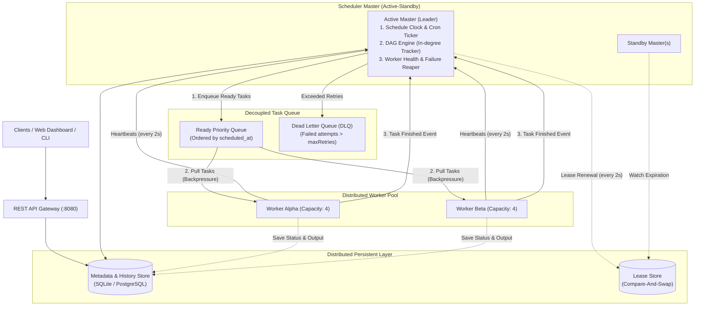

# Distributed Job Scheduler & Workflow Orchestrator

[](https://kotlinlang.org)
[](https://openjdk.org)
[](https://ktor.io)
[]()

A production-grade, distributed job scheduler and DAG workflow orchestrator designed specifically around the **canonical System Design Interview question** (*"Design a Distributed Job Scheduler / Distributed Cron / Workflow Orchestrator like Airflow, Temporal, or Quartz"*) asked at Google, Meta, Uber, Amazon, and Netflix.

---

## Table of Contents
1. [System Design Interview Blueprint](#1-system-design-interview-blueprint)
   - [Requirements](#requirements)
   - [Capacity Estimation & Scale](#capacity-estimation--scale)
2. [Cluster Architecture & Data Flow](#2-cluster-architecture--data-flow)
3. [Deep-Dive Interview Topics](#3-deep-dive-interview-topics)
   - [At-Least-Once vs. Exactly-Once & Idempotency](#at-least-once-vs-exactly-once--idempotency)
   - [Split-Brain Protection & Fencing Tokens](#split-brain-protection--fencing-tokens)
   - [High-Precision Delayed Scheduling (Two-Tier Bucketing)](#high-precision-delayed-scheduling-two-tier-bucketing)
   - [Push vs. Pull Task Dispatch & Backpressure](#push-vs-pull-task-dispatch--backpressure)
   - [DAG Orchestration via Topological In-Degree](#dag-orchestration-via-topological-in-degree)
   - [Worker Health, Heartbeats & Task Reclamation](#worker-health-heartbeats--task-reclamation)
   - [Exponential Backoff with Jitter & Dead Letter Queue (DLQ)](#exponential-backoff-with-jitter--dead-letter-queue-dlq)
4. [Codebase Architecture & File Mapping](#4-codebase-architecture--file-mapping)
5. [Quickstart & Running Locally](#5-quickstart--running-locally)
   - [Running the Cluster](#running-the-cluster)
   - [Interactive Web Dashboard](#interactive-web-dashboard)
   - [REST API Reference & cURL Examples](#rest-api-reference--curl-examples)
6. [Running the Test Suite](#6-running-the-test-suite)

---

## 1. System Design Interview Blueprint

### Requirements

#### Functional Requirements
1. **Flexible Scheduling**:
   - **One-off delayed jobs**: Execute at a specific future timestamp ($T$).
   - **Recurring Cron schedules**: Standard 5-field cron syntax (`minute hour dayOfMonth month dayOfWeek`) and presets (`@daily`, `@hourly`, etc.).
   - **Immediate / Manual triggers**: Trigger job executions immediately via API or Web UI.
2. **DAG Workflow Dependencies**:
   - Tasks within a job can declare dependencies on other tasks (Directed Acyclic Graph).
   - Upstream tasks must complete successfully before downstream tasks are dispatched.
   - Cycle detection and validation using Kahn's algorithm.
3. **Worker Pool & Execution**:
   - Decoupled worker nodes pull tasks and run sandboxed actions (Shell commands, HTTP calls, JVM execution).
   - Execution timeout enforcement.
4. **Fault Tolerance & Resilience**:
   - **Worker crash detection**: Heartbeat monitoring; if a worker stops emitting heartbeats, tasks are reclaimed and rescheduled.
   - **Automatic retries**: Exponential backoff with jitter.
   - **Dead Letter Queue (DLQ)**: Tasks exceeding `maxRetries` are safely routed to DLQ with full diagnostic history and manual replay.
5. **Observability & Management**:
   - HTTP REST API for cluster health, job submission, and execution metrics.
   - Embedded real-time Web Dashboard visualizing workers, DAG progress, and failovers.

#### Non-Functional Requirements
- **High Availability**: No single point of failure (SPOF). Active-Standby Coordinator failover.
- **Precision**: Accurate trigger dispatch within $\pm 1$ second.
- **Idempotency**: Prevent duplicate executions using fencing tokens and idempotency keys.
- **Scalability**: Decoupled pull-based workers scale horizontally without coordinator saturation.

### Capacity Estimation & Scale
- **Daily job volume**: 100 million scheduled runs/day $\approx 1{,}160$ jobs/sec average (peak $5{,}000$ jobs/sec).
- **Metadata storage**: $1\text{ KB}$ per job definition $\times 10\text{M jobs} = 10\text{ GB}$.
- **Execution log storage**: $2\text{ KB}$ per execution $\times 100\text{M runs/day} = 200\text{ GB/day}$. Retained with TTL / cold archiving.

---

## 2. Cluster Architecture & Data Flow



### End-to-End Execution Lifecycle
1. **Job Registration**: User registers a Job with tasks and dependencies via `POST /api/jobs`.
2. **Trigger Evaluation**:
   - The active Leader continuously evaluates the scheduling clock.
   - When a job is ready, a `JobRun` is created and stored in the database.
3. **DAG Initial Dispatch**:
   - The DAG engine evaluates task in-degrees. All tasks with $0$ dependencies are marked `QUEUED` and placed in the `ReadyQueue`.
4. **Worker Execution (Pull Model)**:
   - Workers query `ReadyQueue.poll()`. If capacity is available, a worker picks up the task and transitions it to `RUNNING`.
   - The worker executes the action (Shell / HTTP) inside an enforced coroutine/process timeout.
5. **Task Completion & DAG Propagation**:
   - Upon completion, the worker reports the result back to the active Coordinator.
   - The Coordinator transitions the completed task to `COMPLETED` and queries downstream dependent tasks.
   - Any dependent task whose upstream requirements are now fully satisfied is enqueued immediately.
   - When all tasks in the DAG reach `COMPLETED`, the `JobRun` is marked `COMPLETED`.

---

## 3. Deep-Dive Interview Topics

### At-Least-Once vs. Exactly-Once & Idempotency
- **Why Exactly-Once is impossible in distributed networks**: The Two Generals' Problem and network partitions mean an execution ack can be lost after a worker successfully finishes.
- **The Industry Standard Solution**: **At-Least-Once Delivery + Idempotent Execution**:
  1. Every task instance has a deterministic unique ID: `taskInstanceId = "${runId}-${taskId}-${attempt}"`.
  2. The storage layer uses **atomic upsert / conditional writes** (`ON CONFLICT(instance_id) DO UPDATE`).
  3. External actions must accept an **Idempotency Key** so repeated execution does not duplicate side effects.

### Split-Brain Protection & Fencing Tokens
- **The Problem**: If an active Master experiences a long GC pause or transient network partition, standby masters assume it died and elect a new leader. When the old master wakes up, both masters might dispatch conflicting tasks (**Split-Brain**).
- **The Solution (Martin Kleppmann Fencing Tokens)**:
  1. Every time leadership changes, the coordination store increments a monotonic **fencing token** ($E_{k+1} = E_k + 1$).
  2. Every task queued or state persisted by the leader carries this token.
  3. Workers and storage reject any commands carrying a token strictly lower than the latest known active token.

### High-Precision Delayed Scheduling (Two-Tier Bucketing)
- **The Naive Mistake**: `SELECT * FROM jobs WHERE scheduled_at <= NOW()` every second causes database table locks and burns CPU under millions of records.
- **The Interview Solution (Two-Tier Scheduling)**:
  1. **Tier 1 (Database / Cold Store)**: Stores all future jobs. A pre-fetcher process queries in 1-minute batches (`scheduled_at BETWEEN NOW() AND NOW() + 1 minute`).
  2. **Tier 2 (In-Memory / Hot Store)**: Hot jobs for the current minute are placed in an in-memory **Min-Heap (Priority Queue)** or **Redis Sorted Set (`ZSET`)** keyed by timestamp. The dispatch clock only sleeps until the top item is due.

### Push vs. Pull Task Dispatch & Backpressure
- **Push Model Flaws**: Coordinator pushes tasks to workers. If Worker A is running slow tasks, it gets overloaded while Worker B is idle, requiring complex remote load-tracking.
- **Pull Model Advantages (Used here)**: Workers pull from the queue only when `currentLoad < capacity`. This provides **natural load balancing** and **backpressure** without coordinator overhead.

### DAG Orchestration via Topological In-Degree
- **Validation**: At submission, `DAGEngine.validateAndSort()` uses **Kahn's Algorithm**:
  $$\text{inDegree}(v) = \text{number of upstream dependencies}$$
  If the number of topologically sorted nodes does not equal total tasks, a cycle exists and the submission is rejected immediately.
- **Runtime Progression**: When Task $U$ completes, the Coordinator queries all dependent tasks $V$. If $\forall P \in \text{parents}(V), \text{status}(P) == \text{COMPLETED}$, Task $V$ is enqueued.

### Worker Health, Heartbeats & Task Reclamation
- Workers emit heartbeats every 2 seconds: `WorkerInfo(workerId, capacity, currentLoad, activeTasks)`.
- If $T_{\text{now}} - T_{\text{lastHeartbeat}} > 8\text{ seconds}$, the Coordinator **Reaper** marks the worker `DEAD`.
- All tasks assigned to the dead worker are reclaimed and requeued with backoff.

### Exponential Backoff with Jitter & Dead Letter Queue (DLQ)
- Retries calculate delay using truncated exponential backoff with full jitter:
  $$\text{delay} = \min(\text{maxBackoff}, \text{base} \times 2^{\text{attempt}-1}) + \text{random}(0, \text{jitter})$$
- Jitter prevents the **Thundering Herd** problem where thousands of retrying workers strike an upstream database at the exact same second.
- Once `attempt > maxRetries`, the task moves to the **Dead Letter Queue (DLQ)** for operator inspection and replay.

---

## 4. Codebase Architecture & File Mapping

```
job-scheduler/
├── src/main/kotlin/com/tarashor/scheduler/
│   ├── Main.kt                           # Cluster bootstrap entrypoint
│   ├── core/
│   │   ├── model/Models.kt               # Domain data models (JobSpec, TaskSpec, DAG, Lease, DLQ)
│   │   ├── cron/CronParser.kt            # 5-field Cron parser with interval & preset support
│   │   └── dag/DAGEngine.kt              # Topological sort, cycle detector (Kahn's), DAG state machine
│   ├── cluster/
│   │   └── LeaderElection.kt             # Leased leader election with Monotonic Fencing Tokens
│   ├── queue/
│   │   └── TaskQueue.kt                  # Decoupled Priority Queue, Exponential Backoff & DLQ
│   ├── storage/
│   │   └── Storage.kt                    # Clean Repository Pattern (InMemory & Persistent SQLite)
│   ├── worker/
│   │   ├── TaskRunner.kt                 # Sandboxed runners: Shell commands, HTTP calls, Simulation
│   │   └── WorkerNode.kt                 # Pull-based worker with heartbeat agent & timeout protection
│   ├── coordinator/
│   │   └── SchedulerCoordinator.kt       # Master brain: schedule clock, DAG resolver, failure reaper
│   ├── api/
│   │   └── SchedulerApiServer.kt         # Ktor REST API endpoints & CORS configuration
│   └── ui/
│       └── DashboardHtml.kt              # Embedded real-time Web Dashboard
├── src/main/resources/
│   └── static/index.html                 # Modern, responsive Web UI dashboard template
└── src/test/kotlin/com/tarashor/scheduler/
    ├── CronParserTest.kt                 # Cron syntax, intervals, and leap-time edge cases
    ├── DAGValidatorTest.kt               # Kahn's topological sort, diamond DAG, cycle detection
    ├── LeaderElectionTest.kt             # Mutual exclusion, lease renewal, automated failover
    ├── TaskQueueAndDLQTest.kt            # Priority polling, backoff math, DLQ routing & replay
    └── EndToEndSchedulerTest.kt          # Full integration: 3-stage DAG execution & worker crash reclamation
```

---

## 5. Quickstart & Running Locally

### Prerequisites
- JDK 25 or 26 (foojay toolchain resolver included)
- macOS / Linux / Windows

### Running the Cluster
Run the standalone cluster with one command:
```bash
./gradlew run
```

This starts:
1. **Master Coordinator** (`active-master`) on port `8080` with active leadership and fencing token `1`.
2. **Two Worker Nodes** (`worker-alpha` and `worker-beta`), each with capacity 4.
3. **SQLite Persistent Database** (`scheduler.db`).
4. **Pre-configured Jobs**:
   - `system-heartbeat-cron`: Recurring cron running every 5 minutes (`*/5 * * * *`).
   - `sample-etl-dag`: 4-stage sequential + branching DAG (`extract-sales` + `extract-inventory` $\rightarrow$ `transform-metrics` $\rightarrow$ `load-warehouse`).

---

### Interactive Web Dashboard
Open your browser to:
👉 **[http://localhost:8080/](http://localhost:8080/)**

The dashboard provides real-time visualization of:
- **Cluster Topology**: Active leader node, current fencing token, active worker count.
- **Cluster Workers**: Worker status, capacity, current concurrency, active task assignments, heartbeat latency.
- **Registered Jobs**: List of jobs, schedules, and DAG structures.
- **Live DAG Runs**: Step-by-step visual execution state (`QUEUED` $\rightarrow$ `RUNNING` $\rightarrow$ `COMPLETED`).
- **Dead Letter Queue (DLQ)**: View terminal failures with error traces and click **"Retry"** to replay.
- **Simulate Leader Failover**: Click the orange button to force the active leader to step down and watch a standby take over with an incremented fencing token!

---

### REST API Reference & cURL Examples

#### 1. Cluster Health & Leadership
```bash
curl -s http://localhost:8080/api/health | jq
```
```json
{
  "coordinatorId": "active-master",
  "isLeader": true,
  "fencingToken": 1,
  "queueSize": 0,
  "dlqSize": 0
}
```

#### 2. Submit a New DAG Job
```bash
curl -X POST http://localhost:8080/api/jobs \
  -H "Content-Type: application/json" \
  -d '{
    "jobId": "order-processing-pipeline",
    "name": "Order Processing Pipeline",
    "schedule": { "type": "Immediate" },
    "tasks": [
      {
        "taskId": "validate-payment",
        "name": "Validate Payment",
        "action": { "type": "Shell", "command": "echo Payment approved" },
        "timeoutMs": 5000,
        "maxRetries": 3
      },
      {
        "taskId": "reserve-inventory",
        "name": "Reserve Inventory",
        "action": { "type": "Shell", "command": "echo Inventory reserved" },
        "timeoutMs": 5000,
        "maxRetries": 3
      },
      {
        "taskId": "generate-invoice",
        "name": "Generate Invoice",
        "dependencies": ["validate-payment", "reserve-inventory"],
        "action": { "type": "Shell", "command": "echo Invoice generated" },
        "timeoutMs": 5000,
        "maxRetries": 3
      }
    ]
  }'
```

#### 3. Trigger a Job Manually
```bash
curl -X POST http://localhost:8080/api/jobs/sample-etl-dag/trigger
```

#### 4. Query Recent Execution Runs & DAG Progress
```bash
curl -s http://localhost:8080/api/runs | jq
```

#### 5. Trigger Leader Failover
```bash
curl -X POST http://localhost:8080/api/cluster/stepdown
```

#### 6. Inspect & Retry DLQ Tasks
```bash
# List DLQ entries
curl -s http://localhost:8080/api/dlq | jq

# Replay a failed DLQ entry
curl -X POST http://localhost:8080/api/dlq/<entry-id>/retry
```

---

## 6. Running the Test Suite

The test suite thoroughly verifies all distributed systems guarantees:
```bash
./gradlew test
```

| Test Class | Verified Capabilities |
| :--- | :--- |
| **`CronParserTest`** | Standard 5-field cron parsing, steps (`*/5`), ranges (`1-5`), named weekdays (`MON`), and presets (`@daily`). |
| **`DAGValidatorTest`** | Kahn's algorithm topological sorting, diamond dependencies, cycle detection, and self-loop rejection. |
| **`LeaderElectionTest`** | Lease acquisition, mutual exclusion, lease renewal, manual stepdown, and standby takeover with fencing token increment. |
| **`TaskQueueAndDLQTest`** | Priority order by `scheduled_at`, exponential backoff delay calculation, DLQ routing upon retry exhaustion, and replay. |
| **`EndToEndSchedulerTest`** | Full end-to-end DAG execution across workers in strict dependency order, plus worker heartbeat timeout & task reclamation by the Reaper. |

---

## License
MIT
